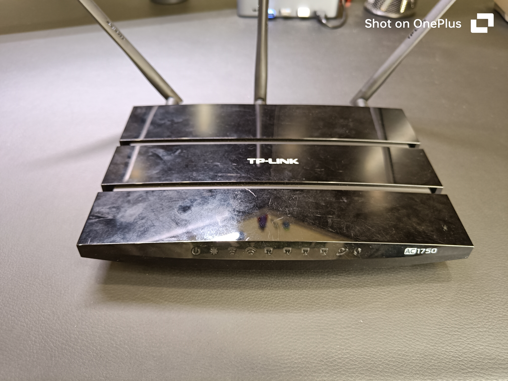
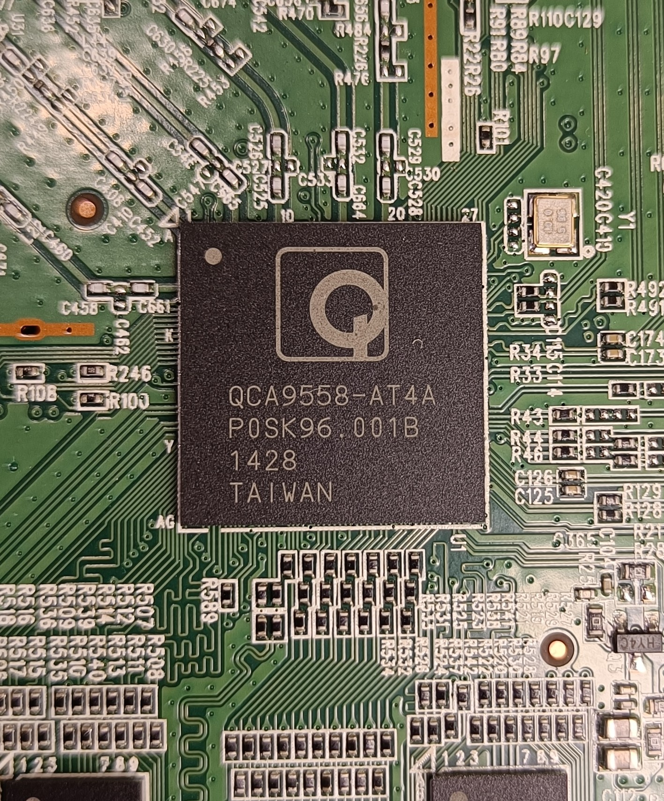
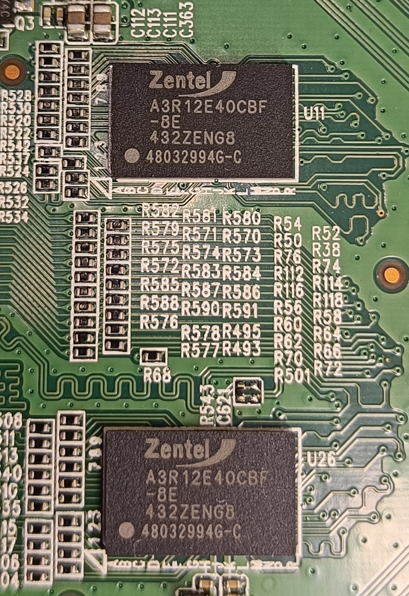
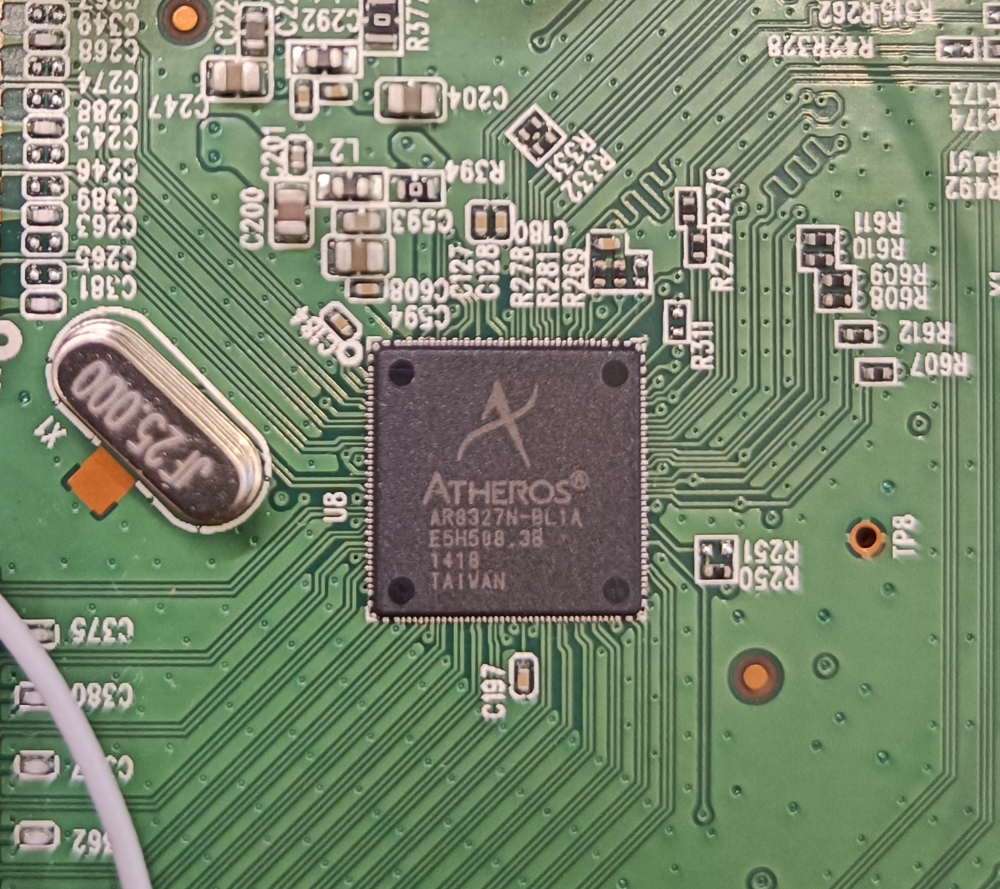

# Hardware overview

## Exterior

AC Wireless Dual Band Gigabit Router

## PCB overview

Single main PCB with Wi-Fi module

## System-on-Chip (SoC)

### Wi-Fi SoC

- Model: QCA9558-AT4A
- Specs: [QCA9558 specs](https://www.excelpoint.com/product/qualcomm-wireless-module-qca-9558-wifi-soc/)

  

### WLAN SoC

- Model: QCA9880-BBR4A
- Datasheet (similar): [QCA9886 datasheet](doc/QCA9886_datasheet.pdf)

  

## RAM 

- Model: 2 x A3R12E40CBF DDR2 SDRAM
- Datasheet: [A3R12E40CBF SSDRAM datasheet](doc/A3R12E340CBF_SDRAM_datasheet.pdf)

  

## Flash memory

- Model: S25FL127S
- Datasheet: [S2FL127S datasheet](doc/S2FL127S_datasheet.pdf)

  

## Ethernet switch

- Model: AR8327N-BL1A
- Datasheet: [AR8327N datasheet](doc/AR8327.PDF)

  

