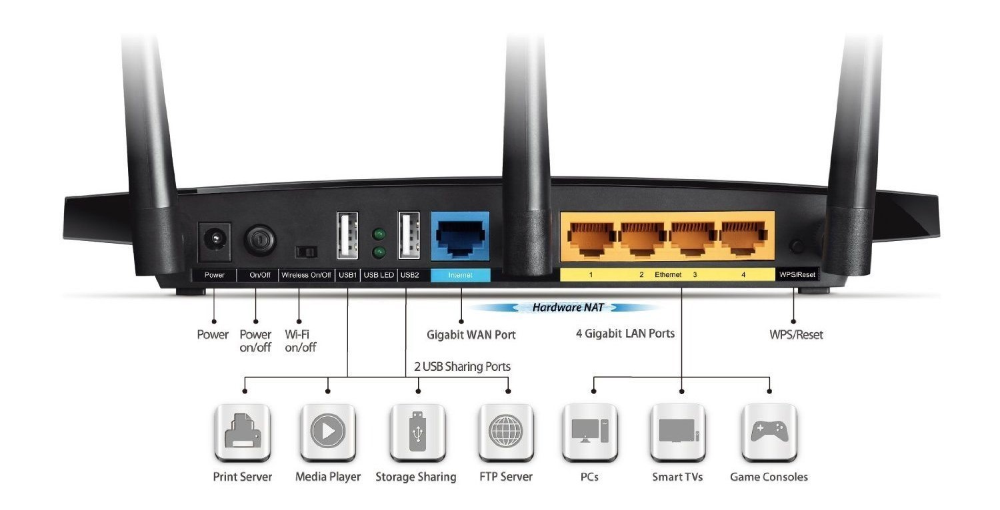

# Scope

The device under test is the TP-Link Archer C7 v2, illustrated in the image below.

  

## Features

  

## Host information

- Manufacturer: TP-Link
- Model: Archer C7
- Hardware version: v2.0
- FCC ID: TE7C7V2
- S/N: 2149198002806

AC Wireless Dual Band Gigabit Router

## Disclaimer 

