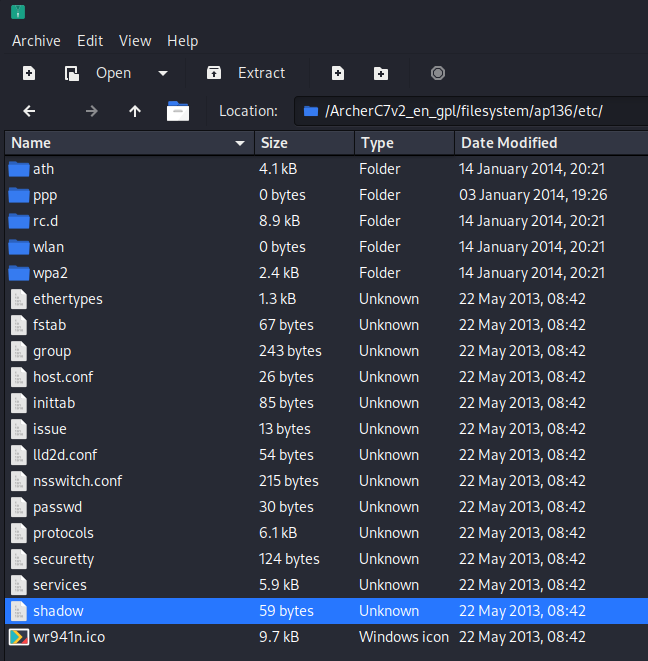
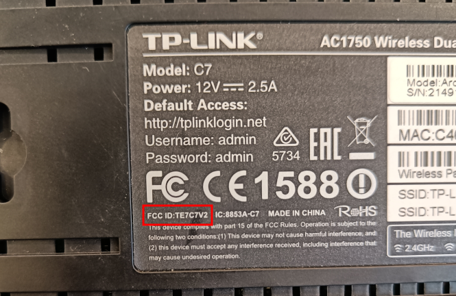
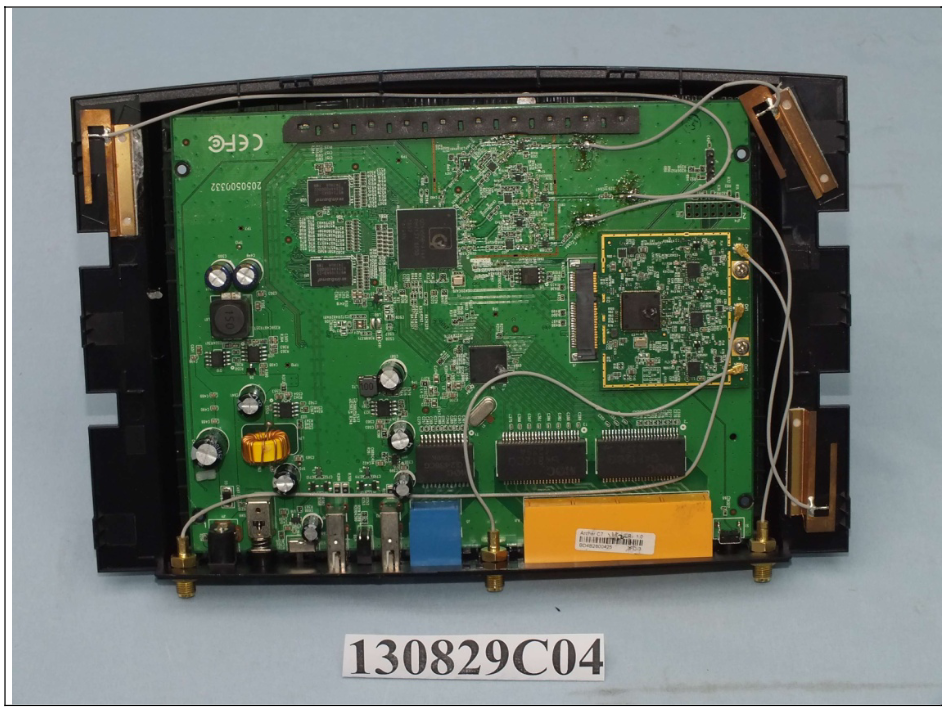
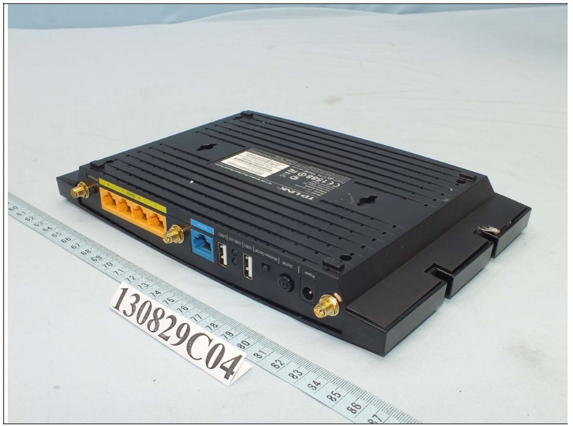
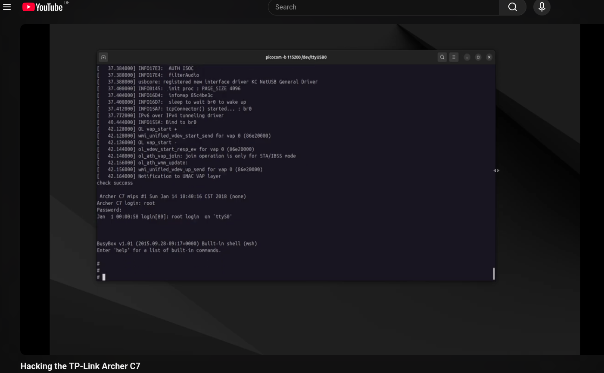

# Open-Source Intelligence (OSINT)

Open-Source Intelligence (OSINT) is the collection and analysis of data gathered from publicly available sources in order to build knowledge about a target. In the context of embedded device penetration testing, OSINT represents a natural starting point since manufacturers routinely publish product specifications, user manuals, firmware updates, and regulatory filings, all of which can provide valuable insight into a device's architecture and potential attack surface before any physical interaction takes place.

Beyond manufacturer-published material, publicly disclosed vulnerabilities and prior research on the same or similar devices can help identify the most valuable areas of focus. An attacker who invests time in OSINT arrives at the hardware phase with a significantly clearer picture of what to look for.

In this assessment, publicly available sources were consulted using search engines including Google and Yandex, alongside specialised repositories, in order to gather as much relevant information about the target as possible prior to hands-on analysis.

## Manufacturer's website

On the [TP-Link website](https://www.tp-link.com/en/home-networking/wifi-router/archer-c7/) it is possible to find the following information:

- overview of the target and its features
- target's specifications in terms of wireless operation, security, hardware and software
- compatible mobile application for configuration and management
- target [User Guide](../5_appendix/5_01_osint/ArcherC7_userGuide.pdf)
- target [Datasheet](../5_appendix/5_01_osint/ArcherC7_datasheet.pdf)
- various target [firmware versions](https://www.tp-link.com/pt/support/download/archer-c7/v2/) available for download
- virtual Web GUI emulator
- [GPL code](https://www.tp-link.com/pt/support/download/archer-c7/v2/#GPL-Code) available for download (which includes the filesystem /etc/ folder, containing the root hash in the shadow file)
 
In regards to the GPL code, this artifact was downloaded from the manufacturer's website and its contents were inspected. This artifact was found to contain the `/etc/` folder of the firmware's filesystem and, within it, the `shadow` file (see image below).

<p align="center">
  
</p>

This file's contents were then investigated and found to possess the root user's hash, as seen in the log below.

```
root:$1$GTN.gpri$DlSyKvZKMR9A9Uj9e9wR3/:15502:0:99999:7:::
```

An attempt was made at finding the root password through the submission of the hash to an [online rainbow table lookup service](https://hashes.com/en/decrypt/hash). As seen in the image below, a match was found, revealing a nine character plaintext password. Since the hash uses a weak algorithm and is reversible via rainbow table lookup, this has been added as finding [HIGH-01](../4_findings/HIGH-01-root-hash-publicly-available-and-reversible.md).

<p align="center">

</p>

## Federal Communications Commission (FCC)

Products that employ radio communications, such as Bluetooth or Wi-Fi, must comply with national regulations in order to be authorized for use in a given country. In the case of the United States, this authorization is determined by the Federal Communications Commission (FCC). 

Searching the FCC database for the specific target or similar ones is a common way to obtain knowledge of the system. However, in order to do so, the FCC ID of the device must first be obtained which, in this case, was found to be identified on the underside of the device as seen in the image below.

<p align="center">
  
</p>

FCC ID `TE7C7V2` was therefore identified and searched for in the FCC database having returned relevant results for the target in question (see [here](https://apps.fcc.gov/oetcf/eas/reports/ViewExhibitReport.cfm?mode=Exhibits&RequestTimeout=500&calledFromFrame=N&application_id=XNkW3PXmhGkYtpZ63u%2BJ8A%3D%3D&fcc_id=TE7C7V2)). The most interesting of which included [internal](../5_appendix/5_01_osint/FCC_Internal_Photos.pdf) and [external](../5_appendix/5_01_osint/FCC_External_Photos.pdf) photos of the device, exemplified in the figures below.

<p align="center">
  
  
</p>

With this information, an attacker can gain knowledge regarding the target's internal components as well as external communication interfaces without requiring direct physical access to a device.

## Blogs

Two blogs by the same authors were found online containing publicly disclosed vulnerabilities concerning the target in question:

- [Blog #1](https://www.infosecmatter.com/metasploit-module-library/?mm=exploit/linux/misc/tplink_archer_a7_c7_lan_rce)
- [Blog #2](https://www.flashback.sh/blog/minesweeper-tplink-archer-lan-rce)

Both talk about the same topic, an unauthorized LAN Remote Code Execution (RCE) vulnerability. Furthermore, the authors also talk in depth about the impact of the vulnerability and provide detailed steps on how to exploit it.

## YouTube

A YouTube channel was found, containing a video titled "[Hacking the TP-Link Archer C7](https://www.youtube.com/watch?v=eEsk6cr8BXA)". 

In this video, it is shown how the router's UART port can be identified in order to obtain serial output on a machine. Furthermore, the flash chip of the router is also identified with subsequent steps demonstrating how to extract the router's firmware from it. Finally, with both of these steps performed, the author of the video shows how the hash of the firmware's root user can be cracked, revealing the root user password and gaining root privileges to the device (see image below).

<p align="center">
  
</p>

