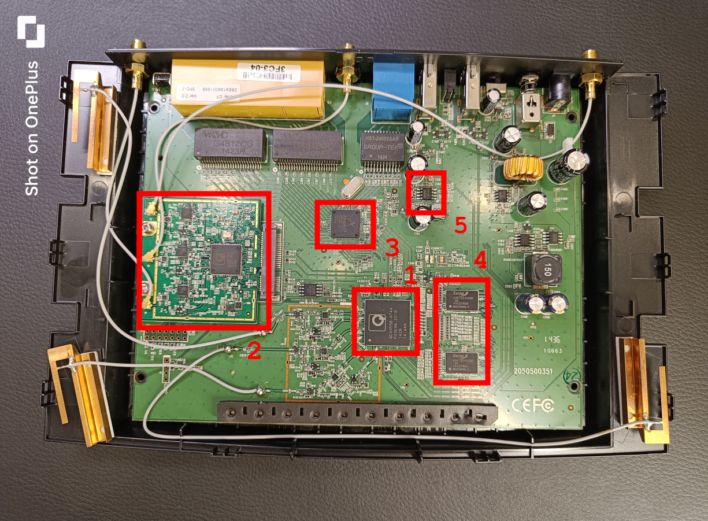

# Hardware analysis

Having completed the reconnaissance phase of the assessment, the next step consisted in analysing the target's hardware components. This involved opening the device and inspecting its Printed Circuit Board (PCB), as seen in the image. Further [close up images](../5_appendix/5_02_hardware-analysis/component-close-ups.md) of the components are provided in the Appendix.

Several relevant components were identified and analysed for vulnerabilities using the National Vulnerability Database (NVD). The results of this analysis can be seen in the table below.

| ID    | Component                   | Description     | Datasheet | Vulnerabilities | 
|-------|-----------------------------|-----------------|-----------|-----------------|
| 1     | QCA9558-AT4A                | Wi-Fi SoC       | [QCA9558 specs](https://www.excelpoint.com/product/qualcomm-wireless-module-qca-9558-wifi-soc/) | [50](https://nvd.nist.gov/vuln/search#/nvd/home?offset=0&rowCount=100&cpeFilterMode=cpe&cpeName=cpe:2.3:h:qualcomm:qca9558:-:*:*:*:*:*:*:*&resultType=records)|
| 2     | QCA9880-BBR4A               | WLAN SoC        | [QCA9886 datasheet (similar)](../5_appendix/5_02_hardware-analysis/QCA9886_datasheet.pdf) | [97](https://nvd.nist.gov/vuln/search#/nvd/home?offset=0&rowCount=100&cpeFilterMode=cpe&cpeName=cpe:2.3:h:qualcomm:qca9880:-:*:*:*:*:*:*:*&resultType=records)|
| 3     | AR8327N-BL1A                | Ethernet switch | [AR8327N datasheet](../5_appendix/5_02_hardware-analysis/AR8327.PDF) | 0 |
| 4     | A3R12E40CBF DDR2 SDRAM (x2) | DDR2 SRAM       | [A3R12E40CBF SSDRAM datasheet](../5_appendix/5_02_hardware-analysis/A3R12E340CBF_SDRAM_datasheet.pdf) | 0 |
| 5     | S25FL127S                   | Flash memory    | [S2FL127S datasheet](../5_appendix/5_02_hardware-analysis/S2FL127S_datasheet.pdf) | 0 |

Since some components have known publicly disclosed vulnerabilities, this has been added as finding [INFO-01](../4_findings/INFO-01-hardware-component-CVEs.md).
