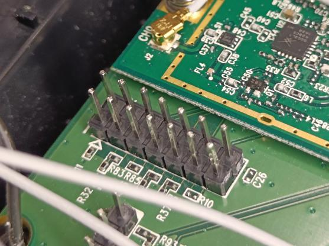
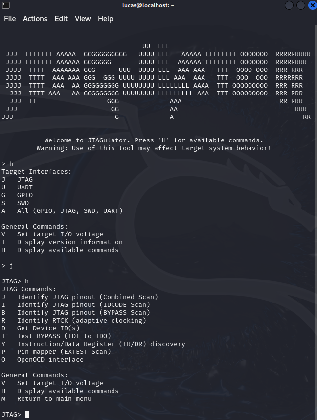
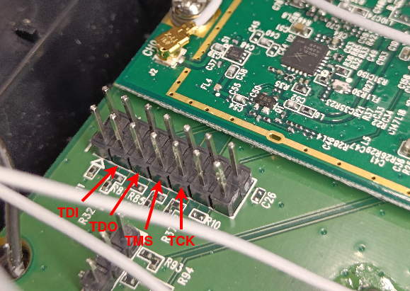

# JTAG Interface Discovery

During [Hardware Analysis](./3_02_hardware-analysis.md), apart from the identified components, a set of fourteen unpopulated through-hole pads located toward the bottom-left area of the PCB stood out as a likely debug interface. 

<p align="center">
  
</p>

Based on their layout and proximity to the SoC, these pads were suspected to be a JTAG interface. The goal of this phase was to confirm whether JTAG was present, identify the pinout, and validate if debugging was possible.

## Preparing the JTAG connection

To enable a stable connection, header pins were soldered to the pads of the possible JTAG interface, as seen below.

<p align="center">
  
</p>

## Serial connection setup

A JTAGulator was used in order to identify the JTAG pinout. The soldered pins were connected from channel 0 through channel 13 on the JTAGulator, as seen below. The ground pin on the JTAGulator was also connected to a known ground point on the target.

<p align="center">
  
</p>

The JTAGulator tool was then connected via USB to the attacking machine for serial communication.

## Identifying the JTAG pins

With the connections in place, the next step was to identify the JTAG pinout. To communicate with the serial interface, the following command was first executed to identify the device node assigned to the JTAGulator tool.

```
┌──(lucas㉿localhost)-[~]
└─$ ls /dev/ttyUSB*
/dev/ttyUSB0
```

This command lists all USB serial interfaces currently recognized by the system. As seen, ```/dev/ttyUSB0``` appeared, confirming successful detection of the serial interface.

A terminal session was then opened to communicate with the JTAGulator software. This was done with the command below.

```
┌──(lucas㉿localhost)-[~]
└─$ screen /dev/ttyUSB0 115200
```

This simply attaches to the serial interface with the JTAGulator's 115200 baud rate. After this, the JTAGulator options menu could be seen.

<p align="center">
  
</p>

### Setting the target voltage

Before performing any scan, the target voltage was set to 3.3V according to the router's logic level.

```
JTAG> v
Current target I/O voltage: Undefined
Enter new target I/O voltage (1.4 - 3.3, 0 for off): 3.3
New target I/O voltage set: 3.3
Warning: Ensure VADJ is NOT connected to target!
```

### Scanning 

JTAGulator provides three scanning options to identify JTAG pinouts:

- combined scan
- IDCODE scan
- BYPASS scan

All three were performed so as to get the best possible chance of identifying the correct JTAG pinout. The obtained outputs for all three scans are presented below.

#### Combined scan

```
JTAG> j
Enter starting channel [0]: 
Enter ending channel [0]: 13
Possible permutations: 24024

Bring channels LOW before each permutation? [y/N]: n
Press spacebar to begin (any other key besides Enter to abort)...
JTAGulating! Press any key to abort...
------
TDI: 5
TDO: 4
TCK: 2
TMS: 3
Device ID #1: 0000 0000000000000000 00000000000 1 (0x00000001)

---------------
JTAG combined scan complete.
```

#### IDCODE scan

```
JTAG> i
Enter starting channel [0]: 
Enter ending channel [13]: 
Possible permutations: 2184

Bring channels LOW before each permutation? [y/N]: n
Press spacebar to begin (any other key besides Enter to abort)...
JTAGulating! Press any key to abort...
------
TDI: N/A
TDO: 4
TCK: 2
TMS: 3
Device ID #1: 0000 0000000000000000 00000000000 1 (0x00000001)

---------------
IDCODE scan complete.
```

#### BYPASS scan

```
JTAG> b
Enter starting channel [0]: 
Enter ending channel [13]: 
Are any pins already known? [Y/n]: n
Possible permutations: 24024

Bring channels LOW before each permutation? [y/N]: n
Press spacebar to begin (any other key besides Enter to abort)...
JTAGulating! Press any key to abort...
-------------------------------------------------------------------------------------------------------------------------------------------------------------------------------------------------------------------------------------------------------------------------------------------------------------------------------------------------------------------------------------------------------------------------------------------------------------------------------------------------------------------------------------------------------------------------------------------------------------------------------------------------------------------------------------------------------------------------------------------------------------------------------------------------------------------------------------------------------------------------------------------------------------------------------------------------
TDI: 5
TDO: 4
TCK: 2
TMS: 3
Number of devices detected: 1
-------------------------------------------------------------------------------------------------------------------------------------------------------------------------------------------------------------------------------------------------------------------------------------------------------------------------------------------------------------------------------------------------------------------------------------------------------------------------------------------------------------------------------------------------------------------------------------------------------------------------------------------------------------------------------------------------------------------------------------------------------------------------------------------------------------------------------------------------------------------------------------------------------------------------------------------------------------------------------------------------------------------------------------------------------------------------------------------------------------------------------------------------------------------------------------------------------------------------------------------------------------------------------------------------------------------------------------------------------------------------------------------------------------------------------------------------------------------------------------------------------------------------------------------------
BYPASS scan complete.
```

### JTAG pinout

The JTAGulator detected one device in the chain, but returned an invalid Device ID of 0x00000001, which suggests that JTAG access may be restricted in production firmware. In any case, the scans consistently and successfully identified four JTAG pins.

| JTAGulator channel    | JTAG wire |
|-----------------------|-----------|
| 2                     | TCK       |
| 3                     | TMS       |
| 4                     | TDO       |
| 5                     | TDI       |

The JTAGulator channels were then mapped back to the PCB pins, identifying the JTAG interface below.

<p align="center">
  
</p>