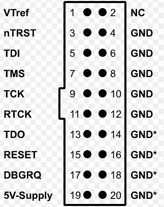
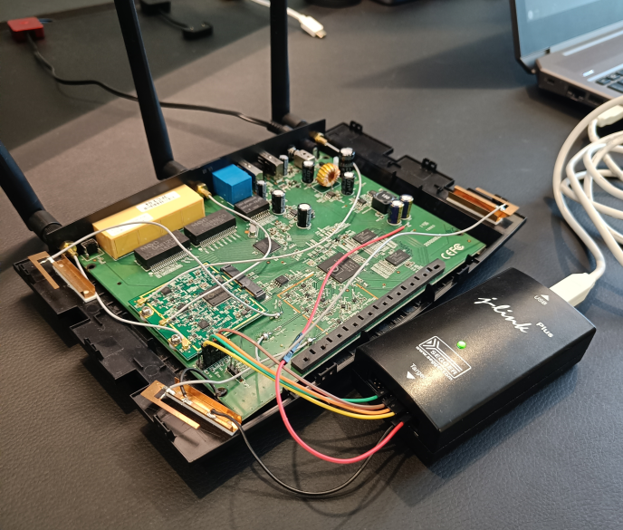

# JTAG Interface Discovery

During the [Hardware Analysis](./3_02_hardware-analysis.md) chapter, apart from the identified components, a set of fourteen unpopulated through-hole pads located toward the bottom-left area of the PCB (see image below) stood out as a likely debug interface. 

<p align="center">
  
</p>

Based on their layout and proximity to the SoC, these pads were suspected to be a JTAG interface. The goal of this phase was to confirm whether JTAG was present, identify the pinout, and validate if debugging was possible.

## Preparing the JTAG connection

To enable a stable connection, header pins were soldered to the pads of the possible JTAG interface, as seen below.

<p align="center">
  
</p>

## Serial connection setup

A [JTAGulator](https://expliot.io/jtagulator/) was used in an attempt to identify the JTAG pinout. The soldered pins were connected from channel 0 through channel 13 on the JTAGulator, as seen below. The ground pin on the JTAGulator was also connected to a known ground point on the target.

<p align="center">
  
</p>

The JTAGulator tool was then connected via USB to an attacking Kali machine for serial communication.

## Identifying the JTAG pinout

With the connections in place, the next step was to identify the JTAG pinout. In order to communicate with the serial interface, the USB serial interface of the JTAGulator tool was first identified by running the following command.

```
┌──(lucas㉿localhost)-[~]
└─$ ls /dev/ttyUSB*
/dev/ttyUSB0
```

As seen, ```/dev/ttyUSB0``` was the interface identified, confirming successful detection. A terminal session was then opened to communicate with the JTAGulator software using the correct baudrate of 115200, as seen in the following command.

```
┌──(lucas㉿localhost)-[~]
└─$ screen /dev/ttyUSB0 115200
```

After this, the JTAGulator options menu could be seen.

<p align="center">
  
</p>

### Setting the target voltage

Before performing any scan, the target voltage was set to 3.3V according to the router's logic level.

```
JTAG> v
Current target I/O voltage: Undefined
Enter new target I/O voltage (1.4 - 3.3, 0 for off): 3.3
New target I/O voltage set: 3.3
Warning: Ensure VADJ is NOT connected to target!
```

### Scanning 

JTAGulator provides three scanning options to identify JTAG pinouts:

- combined scan
- IDCODE scan
- BYPASS scan

All three were performed so as to get the best possible chance of identifying the correct JTAG pinout. The obtained outputs for all three scans are presented below.

#### Combined scan

```
JTAG> j
Enter starting channel [0]: 
Enter ending channel [0]: 13
Possible permutations: 24024

Bring channels LOW before each permutation? [y/N]: n
Press spacebar to begin (any other key besides Enter to abort)...
JTAGulating! Press any key to abort...
------
TDI: 5
TDO: 4
TCK: 2
TMS: 3
Device ID #1: 0000 0000000000000000 00000000000 1 (0x00000001)

---------------
JTAG combined scan complete.
```

#### IDCODE scan

```
JTAG> i
Enter starting channel [0]: 
Enter ending channel [13]: 
Possible permutations: 2184

Bring channels LOW before each permutation? [y/N]: n
Press spacebar to begin (any other key besides Enter to abort)...
JTAGulating! Press any key to abort...
------
TDI: N/A
TDO: 4
TCK: 2
TMS: 3
Device ID #1: 0000 0000000000000000 00000000000 1 (0x00000001)

---------------
IDCODE scan complete.
```

#### BYPASS scan

```
JTAG> b
Enter starting channel [0]: 
Enter ending channel [13]: 
Are any pins already known? [Y/n]: n
Possible permutations: 24024

Bring channels LOW before each permutation? [y/N]: n
Press spacebar to begin (any other key besides Enter to abort)...
JTAGulating! Press any key to abort...
-----------------------------------------------------------
TDI: 5
TDO: 4
TCK: 2
TMS: 3
Number of devices detected: 1
----------------------------------------------------------------------------------------------------------------------------------------------
BYPASS scan complete.
```

### JTAG pinout

The JTAGulator detected one device in the chain, but returned an invalid Device ID of 0x00000001, which suggests that JTAG access may be restricted in production firmware. In any case, the scans consistently and successfully identified four JTAG pins.

| JTAGulator channel    | JTAG wire |
|-----------------------|-----------|
| 2                     | TCK       |
| 3                     | TMS       |
| 4                     | TDO       |
| 5                     | TDI       |

The JTAGulator channels were then mapped back to the PCB pins, identifying the JTAG interface below.

<p align="center">
  
</p>

## Attempting to debug

Having discovered the JTAG interface, debugging was attempted using a [J-Link Plus](https://www.segger.com/products/debug-probes/j-link/models/j-link-plus/) debug probe and [OpenOCD](https://openocd.org/), an open-source software tool that allows debugging of embedded devices.

### Mapping the connections 

The J-Link debug probe possesses the pinout of the following image. 

<p align="center">
  
</p>

This pinout was then mapped to the router's JTAG interface so as to enable debugging. The summary of the established connections can be seen in the following table.

| Pin #      | Pin name  | Established connection on router | Wire colour |
|------------|-------|----------------------------------|-------------|
| 1          | VTref | Known 3.3V voltage point         | Red         |
| 4          | GND   | Known GND point                  | Black       |
| 5          | TDI   | TDI                              | Yellow      |
| 7          | TMS   | TMS                              | Orange      |
| 9          | TCK   | TCK                              | Brown       |
| 13         | TDO   | TDO                              | Green       |

This setup can be viewed in the image below.

<p align="center">
  
</p>

### Identifying the J-Link device

As illustrated in the previous image, the J-Link Plus debug probe was then also connected to the attacking Kali machine via USB for serial output. To check for the correct recognition of the probe, the following command was issued.

```
┌──(lucas㉿localhost)-[~/playground]
└─$ lsusb
...

Bus 001 Device 009: ID 1366:0101 SEGGER J-Link PLUS
...
```

As seen, the output shows that the J-Link debugger is recognized. 

### Creating the required configuration file

OpenOCD requires a configuration file with information regarding the debug adapter being used and parameters regarding communication with the target. The following configuration file was created for this assessment.

```
# J-Link adapter
interface jlink

# Target: MIPS QCA955x
set _CHIPNAME qca955x
set _TARGETNAME $_CHIPNAME.cpu

jtag newtap $_CHIPNAME cpu -irlen 5

target create $_TARGETNAME mips_m4k -chain-position $_TARGETNAME

# 3.3V target
adapter_khz 1000
```

The file specifies:

- `interface jlink`: instructs OpenOCD to use the J-Link as the 
debug adapter.
- `_CHIPNAME` and `_TARGETNAME`: define identifiers for the target and
chip, based on the QCA955x SoC identified during the [Hardware Analysis](./3_02_hardware-analysis.md) chapter.
- `jtag newtap`: declares a new JTAG TAP (Test Access Port) with 
an instruction register length of 5 bits (`-irlen 5`), which is the 
standard value for devices with MIPS architecture such as the router.
- `target create mips_m4k`: creates the debug target using the 
MIPS M4K core architecture (this architecture was chosen since it corresponds to the MIPS 74Kc processor, identified in the [boot log output](../5_appendix/5_05_boot-and-runtime-analysis/boot_output.log) of the following [Boot and Runtime Analysis](3_05_boot-and-runtime-analysis.md) chapter).
- `adapter_khz 1000`: sets the JTAG clock speed to 1MHz, a 
conservative value chosen for initial connection reliability

### Debugging

With the hardware and software in place, the router was powered on and debugging was attempted with the command below. As seen in the command output, the J-Link debugger was identified and listening for connections on ports `6666`, `4444`and `3333`.

```
┌──(lucas㉿localhost)-[~/playground]
└─$ openocd -f archer_c7.cfg
Open On-Chip Debugger 0.12.0
Licensed under GNU GPL v2
For bug reports, read
        http://openocd.org/doc/doxygen/bugs.html
DEPRECATED! use 'adapter driver' not 'interface'
Info : auto-selecting first available session transport "jtag". To override use 'transport select <transport>'.
DEPRECATED! use 'adapter speed' not 'adapter_khz'
adapter speed: 1000 kHz

Info : Listening on port 6666 for tcl connections
Info : Listening on port 4444 for telnet connections
Info : J-Link V10 compiled Jan 30 2023 11:28:07
Info : Hardware version: 10.10
Info : VTarget = 3.290 V
Info : clock speed 1000 kHz
Info : JTAG tap: qca955x.cpu tap/device found: 0x00000001 (mfg: 0x000 (<invalid>), part: 0x0000, ver: 0x0)
Info : starting gdb server for qca955x.cpu on 3333
Info : Listening on port 3333 for gdb connections
```

On a second terminal, a telnet connection on port 4444 was opened, prompting an OpenOCD console, as seen in the log below.

```
┌──(lucas㉿localhost)-[~]
└─$ telnet localhost 4444
Trying ::1...
Connection failed: Connection refused
Trying 127.0.0.1...
Connected to localhost.
Escape character is '^]'.
Open On-Chip Debugger
> 
```

On the first terminal, confirmation of the established connection could be seen, as can be seen in the subsequent log.

```
Info : accepting 'telnet' connection on tcp/4444
Warn : DCR endianness settings does not match target settings
MIPS32 with MIPS16 support implemented
```

With the connection established and the debugging console open, several debug commands were issued, such as:

- `halt`: to halt the target execution
- `reg`: to list register values 

As seen in the log below, the target complied with all issued commands and was susceptible to debugging. 

```
Open On-Chip Debugger
> halt
DCR endianness settings does not match target settings
MIPS32 with MIPS16 support implemented
target halted in MIPS32 mode due to debug-request, pc: 0x800064e0
> reg
===== mips32 registers
(0) r0 (/32): 0x00000000
(1) r1 (/32): 0x00000000
(2) r2 (/32): 0x00000000
(3) r3 (/32): 0x8022a000
(4) r4 (/32): 0x8022c068
(5) r5 (/32): 0x866de9a8
(6) r6 (/32): 0x1100ff00
(7) r7 (/32): 0xffff00fe
(8) r8 (/32): 0x80229fe0
(9) r9 (/32): 0x0000ff00
(10) r10 (/32): 0x00000000
(11) r11 (/32): 0x867ca000
(12) r12 (/32): 0x5a497aab
(13) r13 (/32): 0x3b9aca00
(14) r14 (/32): 0x00000000
(15) r15 (/32): 0x00000001
(16) r16 (/32): 0x80260000
(17) r17 (/32): 0x80259abb
(18) r18 (/32): 0x80260000
(19) r19 (/32): 0x802557cc
(20) r20 (/32): 0x87ff8000
(21) r21 (/32): 0x00000000
(22) r22 (/32): 0x00000000
(23) r23 (/32): 0x87ff8000
(24) r24 (/32): 0x00000000
(25) r25 (/32): 0x801769e8
(26) r26 (/32): 0x7cdffbb0
(27) r27 (/32): 0x867cbfe0
(28) r28 (/32): 0x80228000
(29) r29 (/32): 0x80229ed0
(30) r30 (/32): 0x801c8040
(31) r31 (/32): 0x80008778
(32) status (/32): 0x1100ff00
(33) lo (/32): 0x01822c00
(34) hi (/32): 0x00000028
(35) badvaddr (/32): 0x00558430
(36) cause (/32): 0x00800c20
(37) pc (/32): 0x800064e0
(38) f0 (/32): 0x00000000
(39) f1 (/32): 0x00000000
(40) f2 (/32): 0x00000000
(41) f3 (/32): 0x00000000
(42) f4 (/32): 0x00000000
(43) f5 (/32): 0x00000000
(44) f6 (/32): 0x00000000
(45) f7 (/32): 0x00000000
(46) f8 (/32): 0x00000000
(47) f9 (/32): 0x00000000
(48) f10 (/32): 0x00000000
(49) f11 (/32): 0x00000000
(50) f12 (/32): 0x00000000
(51) f13 (/32): 0x00000000
(52) f14 (/32): 0x00000000
(53) f15 (/32): 0x00000000
(54) f16 (/32): 0x00000000
(55) f17 (/32): 0x00000000
(56) f18 (/32): 0x00000000
(57) f19 (/32): 0x00000000
(58) f20 (/32): 0x00000000
(59) f21 (/32): 0x00000000
(60) f22 (/32): 0x00000000
(61) f23 (/32): 0x00000000
(62) f24 (/32): 0x00000000
(63) f25 (/32): 0x00000000
(64) f26 (/32): 0x00000000
(65) f27 (/32): 0x00000000
(66) f28 (/32): 0x00000000
(67) f29 (/32): 0x00000000
(68) f30 (/32): 0x00000000
(69) f31 (/32): 0x00000000
(70) fcsr (/32): 0x00000000
(71) fir (/32): 0x00000000
```