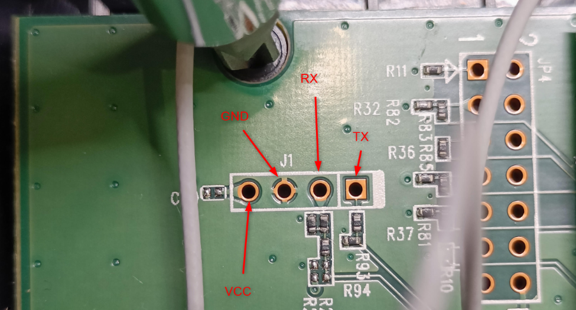
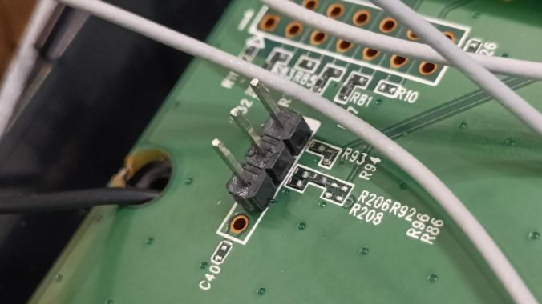

# UART Interface Discovery

During the [Hardware Analysis](./3_02_hardware-analysis.md) chapter, apart from the identified components, a set of four unpopulated through-hole pads located toward the bottom-left area of the PCB stood out as a likely debug interface. Based on their layout and proximity to the SoC, these pads were suspected to be a UART serial interface.

The goal of this phase was to confirm whether UART was present, identify the pinout, and validate that serial communication was possible.

## Identifying the UART pins

The first step was to identify the ground (GND) pin. For this, a continuity test was performed using a multimeter between each of the four pads and known ground reference points on the PCB. Known ground was identified via exposed copper ground pads along the edges of the router casing. One pad showed continuity with ground, confirming it as the GND pin.

  

With the ground pin identified, the router was powered on and the voltage of the remaining three pads was measured relative to GND. Typical UART characteristics were used to identify the remaining pins:

| Pin | Expected Behavior | Observed Characteristics                     |
|-----|-------------------|----------------------------------------------|
| VCC | Power rail        | Steady ~3.3V                                 |
| TX  | Data output       | Fluctuating voltage due to data transmission |
| RX  | Data input        | ~0V when idle, awaiting incoming data        |

Using these observations, the remaining pins were mapped accordingly, confirming the presence of the UART interface seen below.

  

## Preparing the UART connection

To enable a stable connection, header pins were soldered to the required pins of the UART interface on the PCB. The VCC pin was intentionally left unconnected to avoid powering issues in the subsequent section.

  

## Serial connection setup

Finally, in order to confirm UART output, a USB-to-TTL serial adapter was connected between the router and the Kali attacking machine, as shown below.

  

The used connections between the target and the adapter were the following:

| UART Pin     |  Connects to USB–TTL Adapter |
|-----------------|-----------------|
| GND             | GND             |
| TX              | RX              |
| RX              | TX              |

Confirmation regarding the UART interface's activity and accessibility are discussed in the following [Boot and Runtime Analysis](./3_05_boot-and-runtime-analysis.md) chapter.
