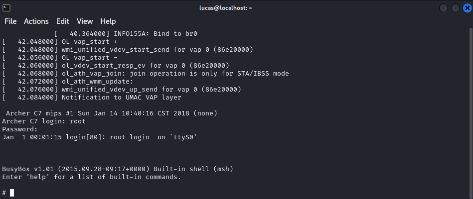

# Boot and Runtime Analysis

The goal of this phase was to analyze the boot process and bootloader behavior as well as assess runtime console access once the system had fully initialized. This was done via the UART interface previously identified in the [UART Interface Discovery](./3_04_uart.md) chapter.

## Serial terminal setup

Having previously established a connection between the target and the attacking Kali machine via a USB-to-TTL serial adapter, the next objective was to open a serial terminal. In order to do so, firstly the device node assigned to the USB-to-TTL adapter was identified.

```
┌──(lucas㉿localhost)-[~]
└─$ ls /dev/ttyUSB*
/dev/ttyUSB0
```

A terminal session was then opened using the `screen` tool, the identified ```/dev/ttyUSB0``` node, and a 115200 baudrate.

```
┌──(lucas㉿localhost)-[~]
└─$ screen /dev/ttyUSB0 115200
```

## Boot behaviour

With the serial terminal active, the router was power-cycled and output similar to the log snippet below was observed (see full log [here](../5_appendix/5_05_boot-and-runtime-analysis/boot_output.log)). Since output could be observed, this confirmed an accessible UART interface, which has been added as finding [LOW-02](../4_findings/LOW-02-accessible-uart-interface.md).

```
=~=~=~=~=~=~=~=~=~=~=~= PuTTY log 2026.02.07 19:01:34 =~=~=~=~=~=~=~=~=~=~=~=

U-Boot 1.1.4 (Jan 14 2018 - 10:37:14)

ap135 - Scorpion 1.0DRAM:  
sri
Scorpion 1.0
ath_ddr_initial_config(179): (32bit) ddr2 init
tap = 0x00000003
Tap (low, high) = (0x3, 0x1b)
Tap values = (0xf, 0xf, 0xf, 0xf)
128 MB
Flash Manuf Id 0x1, DeviceId0 0x20, DeviceId1 0x18
flash size 16MB, sector count = 256
Flash: 16 MB
Using default environment

*** Warning *** : PCIe WLAN Module not found !!!
In:    serial

...

Autobooting in 1 seconds
## Booting image at 9f020000 ...
   Uncompressing Kernel Image ... OK

Starting kernel ...

Booting QCA955x

[    0.000000] Linux version 2.6.31--LSDK-9.2.0_U6.616 (root@liaozhiming) 

...

[    0.412000] Creating 5 MTD partitions on "ath-nor0":
[    0.416000] 0x000000000000-0x000000020000 : "u-boot"
[    0.420000] 0x000000020000-0x000000120000 : "kernel"
[    0.428000] 0x000000120000-0x000000fa0000 : "rootfs"
[    0.432000] 0x000000fa0000-0x000000ff0000 : "config"
[    0.436000] 0x000000ff0000-0x000001000000 : "ART"

...

 Archer C7 mips #1 Sun Jan 14 10:40:16 CST 2018 (none)

Archer C7 login:
...
```

As seen, during boot, information such as the bootloader version and memory partitions of the device are exposed. This has been added as finding [INFO-02](../4_findings/INFO-02-runtime-serial-console-exposed.md).


Checking the previous output once again, it is possible to observe the presence of a U-Boot bootloader and  a message indicating an automatic boot sequence.

```
Autobooting in 1 seconds
```

Two methods were employed in order to attempt interruption of the boot process, namely manual interruption and automated interruption. Both of these are detailed in the subsections below.

### Manual interruption

Repeated attempts were made to interrupt the boot process by sending input to the console before and during the autoboot countdown (essentialy by spamming keys on the keyboard before and during the autoboot time interval). These attempts were unsuccessful, and the system proceeded to boot normally, suggesting that either bootloader interruption via the serial console was partially restricted or that the interruption window was extremely small and difficult to trigger manually.

### Automated interruption

A final attempt was made to interrupt the autoboot sequence using a custom [python script](../5_appendix/5_05_boot-and-runtime-analysis/uboot_spam.py).
The script continuously transmitted newline characters and common U-Boot interrupt sequences over the serial interface during device power-on in order to reliably hit the narrow autoboot interruption window. The output of the run script can be seen below.

```
┌──(lucas㉿localhost)-[~/…/tp-link-archer-c7-v2/pentest/5_appendix/5_05_boot-and-runtime-analysis/]
└─$ python3 uboot_spam.py 
[+] Opening /dev/ttyUSB0 at 115200 baud...
[+] Power on the router NOW.
[+] Spamming interrupt sequences...


U-Boot 1.1.4 (Jan 14 2018 - 10:37:14)

ap135 - Scorpion 1.0DRAM:  
sri
Scorpion 1.0
ath_ddr_initial_config(179): (32bit) ddr2 init
tap = 0x00000003
Tap (low, high) = (0x3, 0x1c)
Tap values = (0xf, 0xf, 0xf, 0xf)
128 MB
Flash Manuf Id 0x1, DeviceId0 0x20, DeviceId1 0x18
flash size 16MB, sector count = 256
Flash: 16 MB

...

: cfg1 0x800c0000 cfg2 0x7214
eth1: ba:be:fa:ce:08:41
eth1 up
eth0, eth1
Setting 0x18116290 to 0x60c1214f
Autobooting in 1 seconds
ap135>  
ap135>  
ap135>  
ap135>  
ap135>  
ap135> 
```

As can be observed, immediately after the autoboot countdown, an ```ap135>``` prompt appeared. This indicated that U-Boot execution had been halted successfuly and an interactive bootloader console had been obtained.

To further confirm successful interruption of the autoboot process, the U-Boot environment variables were enumerated using the following command.

```
ap135> printenv

bootargs=console=ttyS0,115200 root=31:02 rootfstype=jffs2 init=/sbin/init mtdparts=ath-nor0:256k(u-boot),64k(u-boot-env),6336k(rootfs),1408k(uImage),8256k(mib0),64k(ART)
bootcmd=bootm 0x9f020000
bootdelay=1
baudrate=115200
ethaddr=0xba:0xbe:0xfa:0xce:0x08:0x41
ipaddr=192.168.1.111
serverip=192.168.1.100
dir=
lu=tftp 0x80060000 ${dir}u-boot.bin&&erase 0x9f000000 +$filesize&&cp.b $fileaddr 0x9f000000 $filesize
lf=tftp 0x80060000 ${dir}ap135${bc}-jffs2&&erase 0x9f050000 +0x630000&&cp.b $fileaddr 0x9f050000 $filesize
lk=tftp 0x80060000 ${dir}vmlinux${bc}.lzma.uImage&&erase 0x9f680000 +$filesize&&cp.b $fileaddr 0x9f680000 $filesize
stdin=serial
stdout=serial
stderr=serial
ethact=eth0

Environment size: 688/65532 bytes
```

Environment variables were enumerated and, since this confirms successful boot process interruption, this has been added as finding [MEDIUM-03](../4_findings/MEDIUM-03-accessible-bootloader-shell.md). 

## Runtime behavior

At the end of the observed boot output a login prompt could be seen.

```
Archer C7 login:
```

With the `root` username and corresponding password previously recovered in the [OSINT](./3_01_osint.md) chapter, a root shell was successfully obtained, as seen below. This has been added as finding [MEDIUM-04](../4_findings/MEDIUM-04-accessible-root-shell.md).

  <p align="center">
  
  </p>