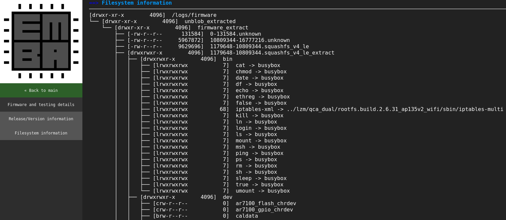
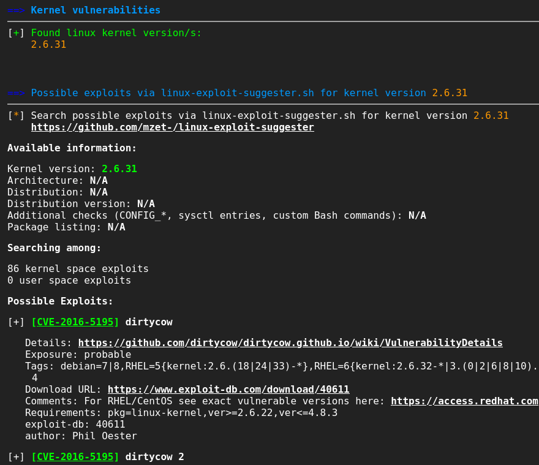
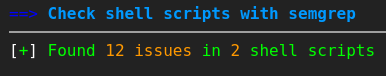
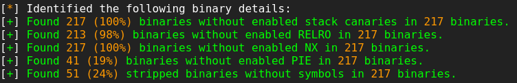
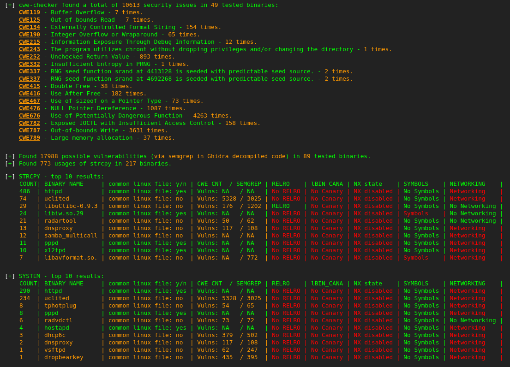
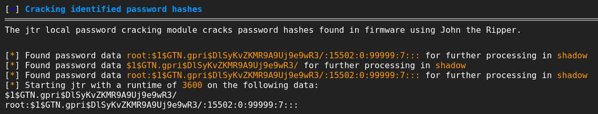
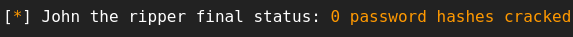
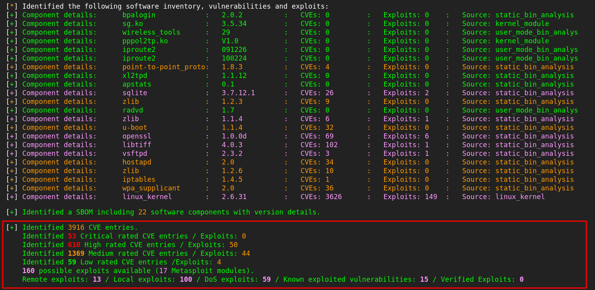

# Automated Firmware Analysis

The automated analysis was done via [EMBA](https://github.com/e-m-b-a/emba), an embedded firmware security analyzer for penetration testers. 
EMBA assists in the identification of possible vulnerabilities in the firmware, providing a potential overview on the existing attack surface. This information can then be used by penetration testers in order to ascertain which focus areas are the most relevant for further investigation.

## Running EMBA

Since EMBA is a command line tool, the first step in order to achieve automated firmware analysis (apart from the download of the tool itself) was to select which binary was to be analyzed and what scan profile to use, the latter choice allowing for shallower/deeper analysis of the firmware by means of disabling/enabling different modules. In this case, these consisted of the already extracted [archer_c7_flash.bin](../5_appendix/5_07_firmware-analysis/archer_c7_flash.bin) file and the full scan profile, respectively. This can be translated into the following command.

```
$ ./emba -f /home/lucas/archer_c7_flash.bin -p full-scan.emba
```

Once finished, EMBA provided a report in HTML format which could be viewed via a browser. This report was therefore checked in search for relevant information and vulnerabilities, as detailed in the following sections.

## Filesystem information

The image below illustrates part of the firmware's filesystem structure and contents which EMBA identified. 
Apart from this identification, EMBA also performed the unpacking of recognized memory partitions, making them available for further manual analysis as will be seen in the [Manual Firmware Analysis](3_07_manual-firmware-analysis.md) section. 

<p align="center">
  
</p>

## Linux kernel configuration

EMBA was able to detect the firmware's Linux Kernel version as version 2.6.31, reporting 86 possible exploits associated with it. 

<p align="center">
  
</p>

## Shell scripts 

In regards to the system's shell scripts, EMBA identified 12 potential issues. These issues warrant a thorough review to ensure adherence to secure coding practices and mitigate potential weaknesses. 

<p align="center">
  
</p>

## Binary protection mechanisms

Some binaries were found to lack essential hardening protection mechanisms, as seen in the summary presented in the image below. 

<p align="center">
  
</p>

## Weak functions and security issues in binaries

The usage of weak functions and security issues in binaries were also reported and identified by EMBA, as seen in the summary of the image below.

<p align="center">
  
</p>

## Cracking identified password hashes

EMBA identified a password hash belonging to the root user in the firmware's filesystem, as seen in the image below.

<p align="center">
  
</p>

Cracking of the hash using the John the ripper tool was attempted in order to obtain the password. However, as seen below, this attempt failed.

<p align="center">
  
</p>

## Vulnerability aggregator

Finally, EMBA was able to detect the use of software components within the firmware and compile a list of vulnerabilities as seen below. 

<p align="center">
  
</p>


