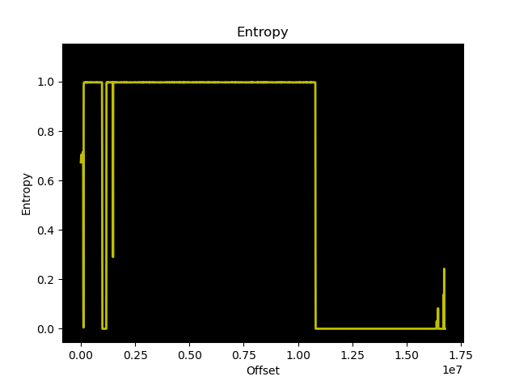
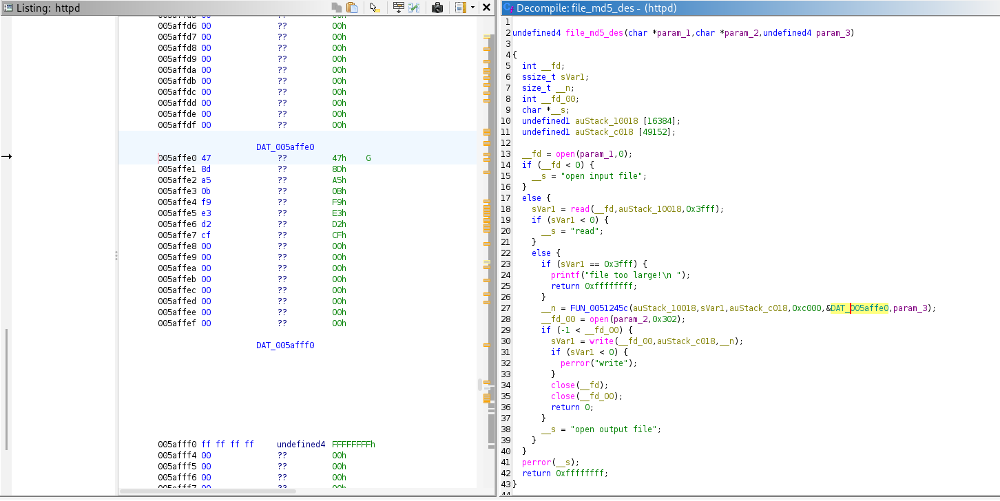
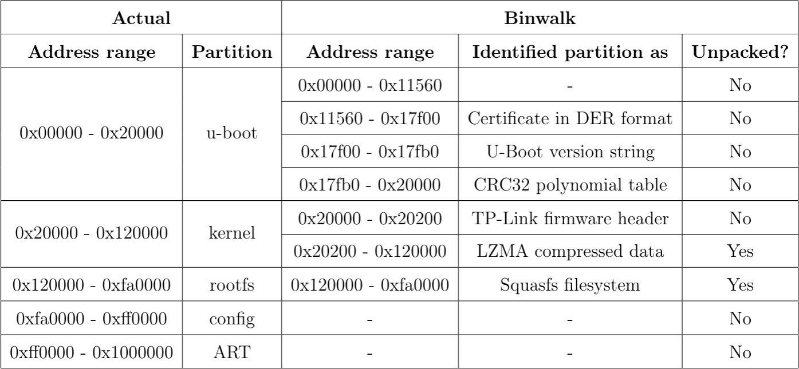

# Manual Firmware Analysis

Having obtained an overview of the target's firmware in the [Automated Firmware Analysis](./3_07_automated-firmware-analysis.md) chapter, further analysis was conducted in a manual manner.

For this analysis, tools such as *binwalk* and *dd* were employed in order to unpack the contents of the different memory partitions of the firmware, which were then checked for vulnerabilities.

## Sanity checks

The first action performed on the firmware upon its extraction from the router's flash was to confirm its content type by using the `file` command line utility. As seen in the log below, the contents of the firmware were identified as `data`.

```
┌──(lucas㉿localhost)-[~]
└─$ file archer_c7_flash.bin 
archer_c7_flash.bin: data
```

Subsequently, in order to get an overview of the firmware's contents, the `strings` command was used on the file. A snippet of the obtained output is presented below.

```
┌──(lucas㉿localhost)-[~]
└─$ strings -n 20 archer_c7_flash.bin
ath_ddr_initial_config
U-Boot 1.1.4 (Jan 14 2018 - 10:37:14)

...

bootargs=console=ttyS0,115200 root=31:02 rootfstype=jffs2 init=/sbin/init mtdparts=ath-nor0:256k(u-boot),64k(u-boot-env),6336k(rootfs),1408k(uImage),8256k(mib0),64k(ART)
bootcmd=bootm 0x9f020000
ethaddr=0xba:0xbe:0xfa:0xce:0x08:0x41
ipaddr=192.168.1.111
serverip=192.168.1.100
lu=tftp 0x80060000 ${dir}u-boot.bin&&erase 0x9f000000 +$filesize&&cp.b $fileaddr 0x9f000000 $filesize
lf=tftp 0x80060000 ${dir}ap135${bc}-jffs2&&erase 0x9f050000 +0x630000&&cp.b $fileaddr 0x9f050000 $filesize
lk=tftp 0x80060000 ${dir}vmlinux${bc}.lzma.uImage&&erase 0x9f680000 +$filesize&&cp.b $fileaddr 0x9f680000 $filesize
TP-LINK Technologies
21232f297a57a5a743894a0e4a801fc3
TP-LINK_Guest_1E55_5G
21232f297a57a5a743894a0e4a801fc3
21232f297a57a5a743894a0e4a801fc3
http://www.tp-link.com

...
```

Next, the entropy of the file was analysed using *binwalk*. This was done through the following command.

```
┌──(lucas㉿localhost)-[~]
└─$ binwalk -E archer_c7_flash.bin
```

Entropy consists of a measure of the randomness, disorder or unpredictability of data within a file. In this case, data with entropy close to 0 can be considered predictable while entropy values close to 1 signify unpredictable data which is either encrypted or compressed. The obtained entropy graph can be seen in the image below.

<p align="center">
  
</p>

The graph shows that some memory partitions within the firmware appear to be encrypted/compressed (entropy=1) while others do not (entropy=0). 

## Identifying memory partitions with binwalk

The next step consisted in identifying the memory partitions of the firmware with binwalk, which listed 6 different ones as seen in the output below.

```
┌──(lucas㉿localhost)-[~]
└─$ binwalk archer_c7_flash.bin
/usr/lib/python3/dist-packages/binwalk/core/magic.py:431: SyntaxWarning: invalid escape sequence '\.'
  self.period = re.compile("\.")

DECIMAL       HEXADECIMAL     DESCRIPTION
--------------------------------------------------------------------------------
71008         0x11560         Certificate in DER format (x509 v3), header length: 4, sequence length: 64
98048         0x17F00         U-Boot version string, "U-Boot 1.1.4 (Jan 14 2018 - 10:37:14)"
98224         0x17FB0         CRC32 polynomial table, big endian
131072        0x20000         TP-Link firmware header, firmware version: 0.0.3, image version: "", product ID: 0x0, product version: -956301310, kernel load address: 0x0, kernel entry point: 0x80002000, kernel offset: 16252928, kernel length: 512, rootfs offset: 855833, rootfs length: 1048576, bootloader offset: 15204352, bootloader length: 0
131584        0x20200         LZMA compressed data, properties: 0x5D, dictionary size: 33554432 bytes, uncompressed size: 2451644 bytes
1179648       0x120000        Squashfs filesystem, little endian, version 4.0, compression:lzma, size: 9626626 bytes, 741 inodes, blocksize: 131072 bytes, created: 2018-01-14 02:55:46
```

However, it was recalled that the [full log](../5_appendix/5_05_boot-and-runtime-analysis/boot_output.log) of the boot process in the [Boot and Runtime Analysis](./3_05_boot-and-runtime-analysis.md) chapter presented the following snippet of output, which corresponds to the exact flash memory layout of the router.

```
[    0.412000] Creating 5 MTD partitions on "ath-nor0":
[    0.416000] 0x000000000000-0x000000020000 : "u-boot"
[    0.420000] 0x000000020000-0x000000120000 : "kernel"
[    0.428000] 0x000000120000-0x000000fa0000 : "rootfs"
[    0.432000] 0x000000fa0000-0x000000ff0000 : "config"
[    0.436000] 0x000000ff0000-0x000001000000 : "ART"
```

Therefore, when comparing the actual partition layout with the binwalk identified partitions, it was found that binwalk was unable to identify or misidentified some of the partitions. 

## Firmware unpacking using binwalk

Regardless of binwalk's misidentified/unidentified memory partitions, unpacking of recognized partitions using this tool was conducted, as seen in the output below. 

```
┌──(lucas㉿localhost)-[~]
└─$ binwalk -e archer_c7_flash.bin 
/usr/lib/python3/dist-packages/binwalk/core/magic.py:431: SyntaxWarning: invalid escape sequence '\.'
  self.period = re.compile("\.")

DECIMAL       HEXADECIMAL     DESCRIPTION
--------------------------------------------------------------------------------
71008         0x11560         Certificate in DER format (x509 v3), header length: 4, sequence length: 64
98048         0x17F00         U-Boot version string, "U-Boot 1.1.4 (Jan 14 2018 - 10:37:14)"
98224         0x17FB0         CRC32 polynomial table, big endian
131072        0x20000         TP-Link firmware header, firmware version: 0.0.3, image version: "", product ID: 0x0, product version: -956301310, kernel load address: 0x0, kernel entry point: 0x80002000, kernel offset: 16252928, kernel length: 512, rootfs offset: 855833, rootfs length: 1048576, bootloader offset: 15204352, bootloader length: 0
131584        0x20200         LZMA compressed data, properties: 0x5D, dictionary size: 33554432 bytes, uncompressed size: 2451644 bytes

WARNING: Symlink points outside of the extraction directory: /home/lucas/embedded-device-pentesting/tp-link-archer-c7-v2/pentest/5_appendix/5_07_firmware-analysis/_archer_c7_flash.bin.extracted/squashfs-root/etc/passwd -> /tmp/passwd; changing link target to /dev/null for security purposes.

WARNING: Symlink points outside of the extraction directory: /home/lucas/embedded-device-pentesting/tp-link-archer-c7-v2/pentest/5_appendix/5_07_firmware-analysis/_archer_c7_flash.bin.extracted/squashfs-root/bin/iptables-xml -> /lzm/qca_dual/rootfs.build.2.6.31_ap135v2_wifi/sbin/iptables-multi; changing link target to /dev/null for security purposes.
1179648       0x120000        Squashfs filesystem, little endian, version 4.0, compression:lzma, size: 9626626 bytes, 741 inodes, blocksize: 131072 bytes, created: 2018-01-14 02:55:46
```

The resulting [_archer_c7_flash.bin.extracted](../5_appendix/5_07_firmware-analysis/unpacked_artifacts/_archer_c7_flash.bin.extracted/) folder was then listed in order to ascertain the partitions binwalk was in fact able to unpack correctly. 

```
┌──(lucas㉿localhost)-[~/_archer_c7_flash.bin.extracted]
└─$ ls
120000.squashfs  20200  20200.7z  squashfs-root  squashfs-root-0
```

Therefore, binwalk was able to correctly unpack two memory partitions, namely:

- `LZMA compressed data`
- `Squasfs filesystem`

## Firmware analysis - binwalk unpacked partitions

### LZMA compressed data

The LZMA compressed data was automatically unpacked, generating the `20200.7z` 7-Zip archive, and then uncompressed, producing the `20200` file. A quick sanity check was performed on this file, by first using the `file` command, which revealed the contents to be of the `data` type.

```
┌──(lucas㉿localhost)-[~]
└─$ file 20200              
20200: data
```

Also, relevant strings were searched for and found within this file, such as the used Linux version and compiler version of the target.

```
┌──(lucas㉿localhost)-[~]
└─$ strings -n 30 20200
Linux version 2.6.31--LSDK-9.2.0_U6.616 (root@liaozhiming) (gcc version 4.3.3 (GCC) ) #1 Sun Jan 14 10:40:16 CST 2018
%s version %s (root@liaozhiming) (gcc version 4.3.3 (GCC) ) %s
<2>BUG: recent printk recursion!
2.6.31--LSDK-9.2.0_U6.616 mod_unload MIPS32_R2 32BIT

...
```

### Squashfs filesystem

In terms of the `Squashfs filesystem` partition, when unpacked by binwalk, generated the `120000.squasfs` compressed filesystem, which was then uncompressed, producing the `squashfs-root` filesystem. A `squashfs-root-0` folder was also generated but was found to be empty for unknown reasons. Therefore, the next step performed in the analysis of the firmware was to enumerate the `squashfs-root` filesystem and search for any underlying vulnerabilities.

#### Finding the root password

Firstly, the root filesystem was listed in order to get an overview of the existing directories, as seen in the log below.

```
┌──(lucas㉿localhost)-[~/_archer_c7_flash.bin.extracted/squashfs-root]
└─$ ls
bin  dev  etc  lib  linuxrc  mnt  proc  root  sbin  sys  tmp  usr  var  web
```

It was noted that the filesystem contained an `etc/` folder. Seen as this folder usually contains credential information in either the `passwd` or `shadow` files, the content of these was checked. 

```
┌──(lucas㉿localhost)-[~/…/unpacked_artifacts/_archer_c7_flash.bin.extracted/squashfs-root/etc]
└─$ ls
ath  passwd  ppp  rc.d  resolv.conf  samba  securetty  services  shadow  wlan  wpa2  wr941n.ico
                          
┌──(lucas㉿localhost)-[~/…/unpacked_artifacts/_archer_c7_flash.bin.extracted/squashfs-root/etc]
└─$ cat passwd                
                                
┌──(lucas㉿localhost)-[~/…/unpacked_artifacts/_archer_c7_flash.bin.extracted/squashfs-root/etc]
└─$ cat shadow
root:$1$GTN.gpri$DlSyKvZKMR9A9Uj9e9wR3/:15502:0:99999:7:::
```

While the `passwd` file was found to be empty, the `shadow` file contained the hash of the root user as previously identified in the [Automated Firmware Analysis](./3_07_automated-firmware-analysis.md) chapter. Therefore, the next step was to attempt to decipher the root password corresponding to the found hash. This was done in two ways: 

- Cracking the hash

  The first approach at finding the root password was by attempting to crack the hash. Seen as this had already been attempted by the automated firmware analysis tool using John the ripper, the `hashcat` command line utility and rockyou wordlist were used. 
  
  Since the hash began with the `$1$` prefix, it could be identified as an md5 based hash. The `hashcat` command supports several hash modes so the correct one was found through the following command.

  ```
  ┌──(lucas㉿localhost)-[~]
  └─$ hashcat --help | grep "md5"  

  ...

   6300 | AIX {smd5}                                                 | Operating System
    500 | md5crypt, MD5 (Unix), Cisco-IOS $1$ (MD5)                  | Operating System
   1600 | Apache $apr1$ MD5, md5apr1, MD5 (APR)                      | FTP, HTTP, SMTP, LDAP Server

  ...
  ```

  The correct mode was found to be `500`. The hash was then copied to a file (`root.hash`) and a common wordlist (`rockyou.txt`) was used to crack the hash. The following command was used.

  ```
  ┌──(lucas㉿localhost)-[~]
  └─$ hashcat -m 500 -a 0 root.hash /usr/share/wordlists/rockyou.txt
  hashcat (v6.2.6) starting

  ...

  Approaching final keyspace - workload adjusted.           

  Session..........: hashcat                                
  Status...........: Exhausted
  Hash.Mode........: 500 (md5crypt, MD5 (Unix), Cisco-IOS $1$ (MD5))
  Hash.Target......: $1$GTN.gpri$DlSyKvZKMR9A9Uj9e9wR3/
  Time.Started.....: Tue May 12 13:56:59 2026 (7 mins, 30 secs)
  Time.Estimated...: Tue May 12 14:04:29 2026 (0 secs)
  Kernel.Feature...: Pure Kernel
  Guess.Base.......: File (/usr/share/wordlists/rockyou.txt)
  Guess.Queue......: 1/1 (100.00%)
  Speed.#1.........:    32328 H/s (11.31ms) @ Accel:32 Loops:1000 Thr:1 Vec:8
  Recovered........: 0/1 (0.00%) Digests (total), 0/1 (0.00%) Digests (new)
  Progress.........: 14344385/14344385 (100.00%)
  Rejected.........: 0/14344385 (0.00%)
  Restore.Point....: 14344385/14344385 (100.00%)
  Restore.Sub.#1...: Salt:0 Amplifier:0-1 Iteration:0-1000
  Candidate.Engine.: Device Generator
  Candidates.#1....: $HEX[203020302030] -> $HEX[042a0337c2a156616d6f732103]
  Hardware.Mon.#1..: Temp: 64c Util: 90%

  Started: Tue May 12 13:56:40 2026
  Stopped: Tue May 12 14:04:30 2026
  ```

  The cracking attempt failed as all the wordlist passwords were exhausted without finding any match. 

- Rainbow table search

  Having once again failed to crack the hash, a last attempt was made at finding the root password through the submission of the hash to an [online rainbow table lookup service](https://hashes.com/en/decrypt/hash). As seen in the image below, a match was found, revealing a nine character plaintext password.

  <p align="center">
  
  </p>

  To verify the credentials against the target device, the router was connected via USB-to-TTL and the UART output was monitored as previously described in the [Boot and Runtime Analysis](./3_05_boot-and-runtime-analysis.md) chapter. Upon the appearance of the login prompt, the recovered credentials were entered and root access was successfully obtained, as seen below.

  <p align="center">
  
  </p>

#### Finding a hardcoded decryption key

In the following [Web Interface Analysis](./3_09_web-interface.md) chapter, one of the found features of the web interface was the ability to download a backup file which could subsequently be used to restore the user's router configurations if required. However, attempting to check the contents of the downloaded configuration file revealed that it was encrypted beforehand. As will be later seen in that chapter, methods to decrypt the file were searched for and found online, revealing that the target employed DES ECB encryption/decryption.

It was then concluded that the logic behind the encryption and decryption conducted on the configuration file must be present within the firmware, meaning the key used for these operations was likely stored in firmware too. With this in mind, the "des" string was searched for in relevant firmware binaries, so as to find the relevant function responsible for the encryption and decryption. A relevant result regarding a `file_md5_des` function was found when searching the `httpd` binary, as seen below.

```
┌──(lucas㉿localhost)-[~/…/_archer_c7_flash.bin.extracted/squashfs-root/usr/bin]
└─$ strings httpd | grep -i "des"                               
...
des_min_do
file_md5_des
FreeListDestroy
sock_destroy
...
```

Ghidra, an open-source reverse engineering software, was used in order to view the source code of the `file_md5_des` function, by importing and decompiling the `httpd` binary file. A search for the function name using Ghidra's Program Text feature revealed the source code required, present in the image below. Upon further investigation of the source code, the decryption key was found to be hardcoded in memory, as seen highlighted.

<p align="center">
  
</p>

#### Looking for Private Identifiable Information

Private identifiable information, such as usernames, passwords, API keys and URLs, were also searched for within the firmware by using the following commands.

```
$ grep -r "admin" .
$ grep -r "root" .
$ grep -r "password" .
$ grep -r "key" .
$ grep -r "api" .
$ grep -r ".com" .
```

These command did not yield any relevant results.

## Manual firmware unpacking

The discrepancies between the actual memory layout and the one identified by binwalk as well as the already unpacked partitions were noted in the table below. 

<p align="center">
  
</p>

This allowed for the identification of memory partitions yet to be unpacked, namely:

* u-boot (0x00000 - 0x20000)
* kernel: TP-Link firmware header (0x20000 - 0x20200)
* config (0xfa0000 - 0xff0000)
* ART (0xff0000 - 0x1000000)

Since binwalk was unable to unpack these correctly, a manual approach using the *dd* command line utility was taken, as detailed below.

* **u-boot**

  **Start address**: 0x00000 (skip=0)

  **End address**: 0x20000 = 131072 (count = 131072 - 0 = 131072)

  ```
  ┌──(lucas㉿localhost)-[~]
  └─$ dd if=archer_c7_flash.bin bs=1 skip=0 count=131072 of=uboot.bin
  131072+0 records in
  131072+0 records out
  131072 bytes (131 kB, 128 KiB) copied, 0.116992 s, 1.1 MB/s
  ```

* **TP-Link firmware header**

  **Start address**: 0x20000 = 131072 (skip=131072)

  **End address**: 0x20200 = 131584 (count = 131584 - 131072 = 512)

  ```
  ┌──(lucas㉿localhost)-[~]
  └─$ dd if=archer_c7_flash.bin bs=1 skip=131072 count=512 of=tp_link_firmware_header.bin
  512+0 records in
  512+0 records out
  512 bytes copied, 0.000468264 s, 1.1 MB/s
  ```

* **config**

  **Start address**: 0xfa0000 = 16384000 (skip=16384000)

  **End address**: 0xff0000 = 16711680 (count = 16711680 - 163840000 = 327680)

  ```
  ┌──(lucas㉿localhost)-[~]
  └─$ dd if=archer_c7_flash.bin bs=1 skip=16384000 count=327680 of=config.bin   
  327680+0 records in
  327680+0 records out
  327680 bytes (328 kB, 320 KiB) copied, 0.288013 s, 1.1 MB/s
  ```

* ART

  **Start address**: 0xff0000 = 16711680 (skip=16711680)

  **End address**: 0x1000000 = 16777216 (count = 16777216 - 16711680 = 65536)

  ```
  ┌──(lucas㉿localhost)-[~]
  └─$ dd if=archer_c7_flash.bin bs=1 skip=16711680 count=65536 of=ART.bin
  65536+0 records in
  65536+0 records out
  65536 bytes (66 kB, 64 KiB) copied, 0.0908209 s, 722 kB/s
  ```

## Firmware analysis - manually unpacked partitions

At this point, all other partitions had been unpacked and were available for analysis. The partitions were stored in the following files/folder:

- [uboot.bin](../5_appendix/5_07_firmware-analysis/unpacked_artifacts/uboot.bin)
- [tp_link_firmware_header.bin](../5_appendix/5_07_firmware-analysis/unpacked_artifacts/tp_link_firmware_header.bin)
- [config.bin](../5_appendix/5_07_firmware-analysis/unpacked_artifacts/config.bin)
- [ART.bin](../5_appendix/5_07_firmware-analysis/unpacked_artifacts/ART.bin)

For the four listed partitions, checks were performed using the `file` and `strings` commands in an attempt to reveal relevant information.

- uboot.bin

  ```
  ┌──(lucas㉿localhost)-[~]
  └─$ file uboot.bin 
  uboot.bin: data
  ```

  Relevant strings such as the used U-Boot version and firmware memory partition information were revealed, as seen below. 

  ```
  ┌──(lucas㉿localhost)-[~]
  └─$ strings -n 12 uboot.bin
  ...

  U-Boot 1.1.4 (Jan 14 2018 - 10:37:14)
  
  ...

  bootargs=console=ttyS0,115200 root=31:02 rootfstype=jffs2 init=/sbin/init mtdparts=ath-nor0:256k(u-boot),64k(u-boot-env),6336k(rootfs),1408k(uImage),8256k(mib0),64k(ART)

  ...
  ```

- tp_link_firmware_header.bin

  ```
  ┌──(lucas㉿localhost)-[~]
  └─$ file tp_link_firmware_header.bin 
  tp_link_firmware_header.bin: firmware c700 v2 TP-LINK Technologies ver. 1.0, version 3.15.3 (US), 16252928 bytes or less, UNKNOWN1 0x1, at 0x200 855833 bytes , at 0x100000 15204352 bytes
  ```
  
  No relevant strings were found in this file.

- config.bin

  ```
  ┌──(lucas㉿localhost)-[~]
  └─$ file config.bin                                                       
  config.bin: BIOS (ia32) ROM Ext. (3*512) instruction 0x0f000000
  ```

  Relevant strings such as the SSID, WPS PIN and Wi-Fi PSK, and the md5 hash of the web interface password were revealed, as seen below.

  ```
  ┌──(lucas㉿localhost)-[~]
  └─$ strings -n 8 config.bin                            
  ...

  TP-LINK_1E55_5G
  TP-LINK_Guest_1E55_5G
  TP-LINK_1E55_5G_3
  TP-LINK_1E55_5G_4
  32901528
  32901528
  32901528
  32901528
  111000010
  sm-server
  TP-LINK_AA1E56
  WORKGROUP
  /tmp/passwd
  root:x:0
  21232f297a57a5a743894a0e4a801fc3
  21232f297a57a5a743894a0e4a801fc3
  http://www.tp-link.com
  Archer C7
  ```

- ART.bin

  ```
  ┌──(lucas㉿localhost)-[~]
  └─$ file ART.bin                                                                              
  ART.bin: data
  ```
  No relevant strings were found in this file.

