# Web Interface Analysis

With the [System Hardening Analysis](./3_08_system-hardening-analysis.md) performed, the next goal was to analyse the router's web management interface, which is accessible at `http://tplinkwifi.net` (or `http://192.168.0.1`) from any device connected to the LAN. The interface contains several features that allow the user to configure the device and view its information. This can be done through several provided menus, such as:

- Status
- Network
- Dual Band Selection
- Wireless 2.4GHz
- Wireless 5GHz
- Guest Network
- DHCP
- USB Settings
- NAT
- Forwarding
- Security
- Parental Control
- Access Control
- Advanced Routing
- Bandwidth Control
- IP & MAC Binding
- Dynamic DNS
- IPv6 Support
- System Tools

The following sections document the security findings identified during the web interface assessment. 

## Authentication

Accessing the web interface for the first time displays a login page prompting a username and password, as seen below. The interface was accessed using the default credentials printed on the device label (`admin`/`admin`). 

<p align="center">
  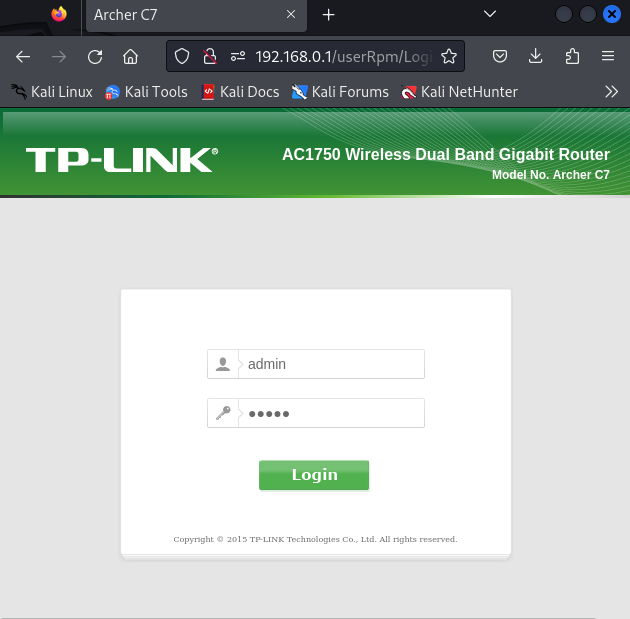
</p>

It was observed that no observable rate limiting or account lockout mechanism existed, allowing for unlimited login retries upon the insertion of incorrect credentials, making the interface susceptible to brute force attacks.

Furthermore, the password change functionality under `System Tools → Password` was found to enforce no complexity requirements whatsoever, accepting single character passwords. This means a user could trivially weaken their credentials further after initial setup.

<p align="center">
  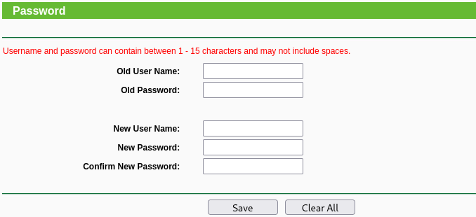
</p>

## Configuration backup and restore

The `System Tools → Backup & Restore` submenu, shown below, allows any authenticated user to download a complete backup of the router's configuration as a binary file (`config.bin`).

<p align="center">
  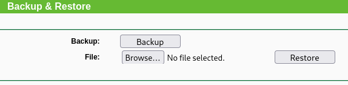
</p>

A backup of the current configuration of the router was performed and initial inspection of the downloaded [config.bin](../5_appendix/5_09_web-interface/config.bin) file suggested encryption, as running the `strings` command against it produced no readable output. However, further research regarding available tools to decrypt this file ([tpconf_bin_xml](https://github.com/sta-c0000/tpconf_bin_xml/blob/master/tpconf_bin_xml.py) and [tp.rb](https://gist.github.com/shreve/7a6413f087c15b233a69bb46edcfec17)) revealed that TP-Link uses hardcoded DES-ECB keys across its consumer router range to encrypt these backup files. 

### Decrypting using tpconf_bin_xml

Having cloned the tool to the Kali environment, the following command was used (providing the seen error below it).

```
┌──(lucas㉿localhost)-[~/tools/tplink/tpconf_bin_xml]
└─$ python3 tpconf_bin_xml.py ~/Downloads/config.bin ~/config.xml
WARNING: Unrecognized file type when using this key! Attempting next one.
WARNING: Unrecognized file type when using this key! Attempting next one.
WARNING: Unrecognized file type when using this key! Attempting next one.
WARNING: Unrecognized file type when using this key! Attempting next one.
ERROR: Unrecognized file type and no known keys left!
```

This indicated that this specific tool did not support the decryption of backup files of the router in question.

### Decrypting using tp.rb

After the previous unsuccessful decryption a last effort was made using the [tp.rb](https://gist.github.com/shreve/7a6413f087c15b233a69bb46edcfec17) script, also available online.
A few tweaks were required in order to run the script correctly via the command below.

```
┌──(lucas㉿localhost)-[~/tools/tplink/7a6413f087c15b233a69bb46edcfec17]
└─$ ruby tp.rb config.bin  
```

In the end, the script provided a decrypted [config.cfg](../5_appendix/5_09_web-interface/config.cfg) file containing the plaintext configuration of the router. The decrypted configuration revealed several sensitive items in plaintext or weakly hashed form, including:

- **Web interface credentials**: admin username and password hash present in MD5 format (`lgn_pwd`, `lgn_opswd`)
- **NAS credentials**: admin credentials for the NAS/USB sharing feature present as both MD5 and NTLM hashes (`nas_user_passwd_login_md5`, `nas_user_passwd_login_smb`)
- **WPS PIN**: WPS PIN exposed in plaintext (`5g_wlan_def_pin`, `5g_wlan_usr_pin`)
- **Wi-Fi PSK**: Wi-Fi pre-shared key exposed in plaintext (`5g_wlan_PskSecret`)

The use of a common hardcoded encryption key across all devices of this product line means that any configuration backup from any Archer C7 can be decrypted by anyone with knowledge of this key, which is publicly documented. Additionally, as previously seen in the [Manual Firmware Analysis](3_07_manual-firmware-analysis.md) chapter, this key is also hardcoded in firmware memory.

## Wireless security

Analysis of both the `Wireless 2.4GHz` and `Wireless 5GHz` menus, revealed that both wireless networks had WPS (Wi-Fi Protected Setup) enabled, using WPA/WPA2 (Wi-Fi Protected Access) Personal security by default, as shown below.

<p align="center">
  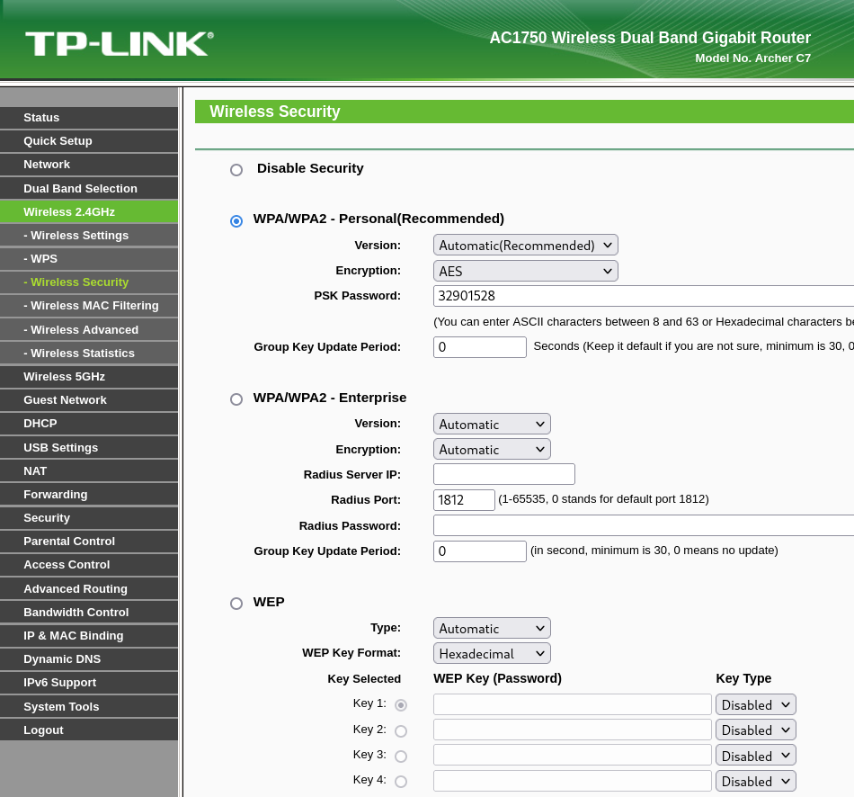
  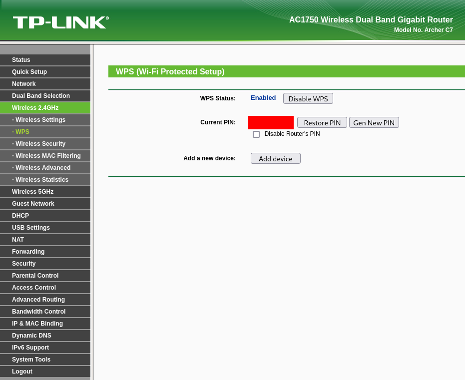
</p>

The web interface also reveals that the default Wi-Fi PSK and WPS PIN are identical. This is significant since an attacker who obtains the WPS PIN will still be able to connect to the network via WPA/WPA2 authentication even in situations where WPS has been disabled as a remediation measure. This is a realistic scenario since, as detailed in the Configuration backup and restore section, the WPS PIN is exposed in plaintext in the decrypted configuration backup file ([config.cfg](../5_appendix/5_09_web-interface/config.cfg)). 

Further testing regarding WPS and WPA/WPA2 is discussed in the subsequent [Wi-Fi Testing](./3_13_wifi.md) chapter.

## Remote Management

Remote management was found to be disabled by default, with the external management IP address set to `0.0.0.0`. 

<p align="center">
  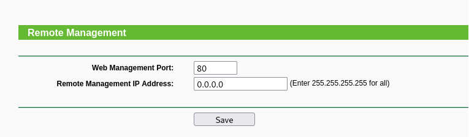
</p>

This means the web interface is not accessible from the WAN port without explicit configuration, which is a positive security default.

## Port Forwarding

The Forwarding menu contains four submenus, each examined for default configuration and security implications:

- **Virtual Servers**: empty by default, no port forwarding rules pre-configured
- **Port Triggering**: empty by default, no rules pre-configured  
- **DMZ**: disabled by default, meaning no internal host is fully 
exposed to the WAN
- **UPnP**: enabled by default

The first three represent positive findings as no unexpected services are exposed to the WAN out of the box. However, as seen in the image below, UPnP is enabled by default, which constitutes a significant concern justified by the findings which are subsequently presented in the [UPnP Testing](./3_10_upnp.md) chapter.

<p align="center">
  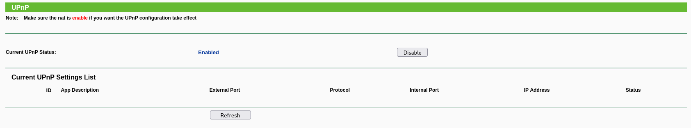
</p>

## Dynamic DNS

The Dynamic DNS submenu allows configuration of a DDNS service provider (No-IP, DynDNS, or Comexe) with associated credentials and domain name. The feature was found to be disabled by default across all three supported providers. To assess how credentials are stored when the feature is configured, DDNS was enabled with test credentials and a new configuration backup was downloaded and decrypted. The relevant snippet from the resulting config file is shown below.

```
ddns_noip_usr ddnsuser
ddns_noip_pwd ddnspassword
```


The test credentials were stored in plaintext in the configuration file, 
confirming that any DDNS credentials configured by a user are exposed in 
the backup without any hashing or encryption. This is consistent with the 
credential storage weaknesses already identified in the Configuration 
backup and restore section.

## USB Settings

The USB Settings menu contains three submenus:

- Disk Settings
- Folder Sharing
- Print Server

These three collectively manage the router's Network Attached Storage (NAS) functionality when a USB storage device is connected to it. Their analysis revealed several security observations, mentioned in the following sections. Further tests regarding the physical USB interface of the router are presented in the [USB Testing](./3_11_usb.md) section.

### Disk Settings

The Disk Settings submenu manages connected USB storage devices. The decrypted configuration backup ([config.cfg](../5_appendix/5_09_web-interface/config.cfg)) confirmed that SMB folder sharing is enabled by default (`nas_smb_enable 1`), meaning any connected USB storage is immediately shared on the network without any explicit configuration. Therefore, an assessment regarding this default behaviour was conducted.

Firstly, a USB drive was connected to one of the router's USB ports. A scan was then performed via the web interface, which identified the mass storage as `volume1`, as seen in the image below.

<p align="center">
  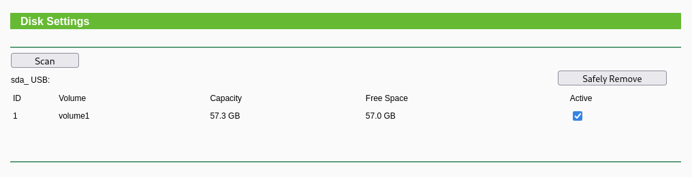
</p>

Subsequently, the listing of shares was attempted via anonymous access, which listed the `volume1` share connected to the target without requiring authentication via username and password, as seen in the log below.

```
┌──(lucas㉿localhost)-[~]
└─$ smbclient -L //192.168.0.1 -N           

        Sharename       Type      Comment
        ---------       ----      -------
        volume1         Disk      
        IPC$            IPC       IPC Service (TP-LINK_AA1E56)
Reconnecting with SMB1 for workgroup listing.

        Server               Comment
        ---------            -------

        Workgroup            Master
        ---------            -------
```

The last step consisted in attempting to connect to the share and, if successful, assess read and write permissions on it. The output below demonstrates these actions.

```
┌──(lucas㉿localhost)-[~]
└─$ smbclient //192.168.0.1/volume1 -N
Try "help" to get a list of possible commands.
smb: \> ls
  .                                   D        0  Mon Jan  1 09:36:33 2018
  ..                                  D        0  Mon Jan  1 08:48:57 2018
  System Volume Information           D        0  Tue Nov 12 23:55:40 2024
  .Trash-1000                        DH        0  Wed Mar 18 22:23:04 2026
  .TPDLNA                            DH        0  Mon Jan  1 09:58:18 2018
  Junk                                D        0  Wed Mar 18 19:43:20 2026

                60048672 blocks of size 1024. 59815232 blocks available
smb: \> mkdir hacked
smb: \> ls
  .                                   D        0  Mon Jan  1 09:36:53 2018
  ..                                  D        0  Mon Jan  1 08:48:57 2018
  System Volume Information           D        0  Tue Nov 12 23:55:40 2024
  .Trash-1000                        DH        0  Wed Mar 18 22:23:04 2026
  .TPDLNA                            DH        0  Mon Jan  1 09:58:18 2018
  hacked                              D        0  Mon Jan  1 09:36:53 2018
  Junk                                D        0  Wed Mar 18 19:43:20 2026

                60048672 blocks of size 1024. 59815200 blocks available
```

As seen, both anonymous read and write access were confirmed. This means any device on the LAN can create, read, modify or delete files on any USB storage connected to the router without providing any credentials. 

Additionally, it was noted that the connection was established via SMB1, a deprecated protocol version that has been disabled by default in modern operating systems.

### Folder Sharing

The Folder Sharing submenu allowed for the configuration of access methods to the connected storage as seen in the image below.

<p align="center">
  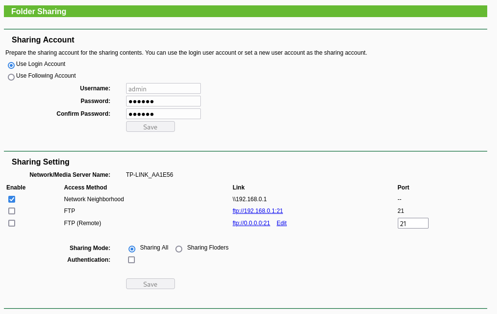
</p>

From this submenu, several observations were made:

- **Credentials inherited from web interface**: folder sharing defaults to using the same credentials as the web management interface via the "Use Login Account" option. This means the weak default credentials (admin/admin) automatically extend to FTP access if enabled, without requiring any additional credential configuration.

- **FTP**: FTP access requires explicit enabling 
through this submenu, explaining the filtered state of port 21 observed during the external network scan performed in the [System Hardening Analysis](./3_08_system-hardening-analysis.md) chapter. From here, FTP was enabled along with authentication and tested for USB storage read and write permissions in three different ways, as illustrated in the table below.

<center>

| FTP login method              |     Read access    |  Write access |
|:-------------------------:|:------------------:|:-------------:|
| Empty credentials         |        ❌          |       ❌      |
| Anonymous login           |        ❌          |       ❌      |
| Web interface credentials |        ✅          |        ✅     |

</center>

- **Remote FTP**: similarly to FTP, remote FTP requires the user to explicitly enable it via this submenu, allowing FTP access from the internet. This option defaults to no authentication, meaning a user could inadvertently expose connected USB storage to the entire internet without any access control. Even if authentication is enabled, the default inherited credentials (admin/admin) provide little protection until changed. Placing these responsibilities entirely on the user introduces significant risk. The combination of a permissive default configuration and weak default credentials means that a simple oversight during setup could result in publicly accessible storage.

### Print Server

The Print Server submenu, which manages the network printing functionality, was found to be enabled by default. An unnecessarily enabled service represents additional attack surface on the device.

<p align="center">
  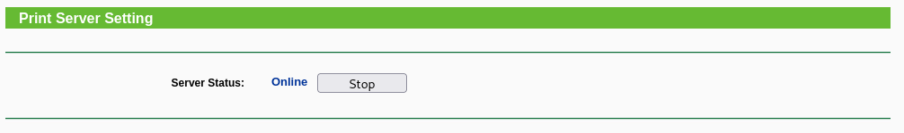
</p>

## Web application security testing

Beyond the configuration and settings analysis, the web interface was 
tested for common web application vulnerabilities, such as:

- SQL injection
- Cross-Site Scripting (XSS)
- Command injection
- Authentication bypass via direct URL access
- Cross-Site Request Forgery (CSRF)

The performed tests regarding all of these vulnerabilities are detailed in the following sections.

### SQL Injection

SQL injection was attempted on the login form by inserting common injection payloads into the username and password fields, having returned an authentication failure, as exemplified below.

<p align="center">
  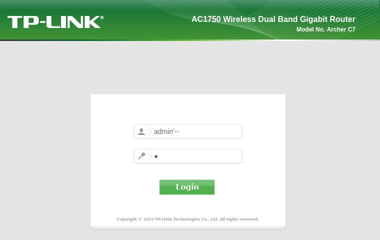
  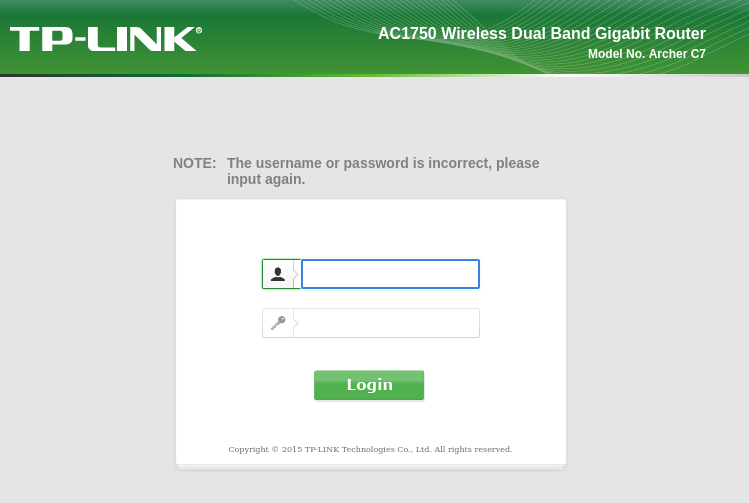
</p>

This behaviour suggests the backend correctly sanitises user input. Therefore, no SQL injection vulnerability was identified.

### Cross-Site Scripting (XSS)

XSS was attempted by inserting script tags and common payloads into various input fields throughout the interface, as seen below. 

<p align="center">
  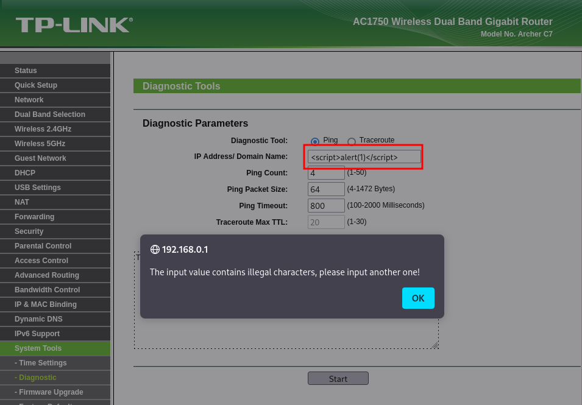
  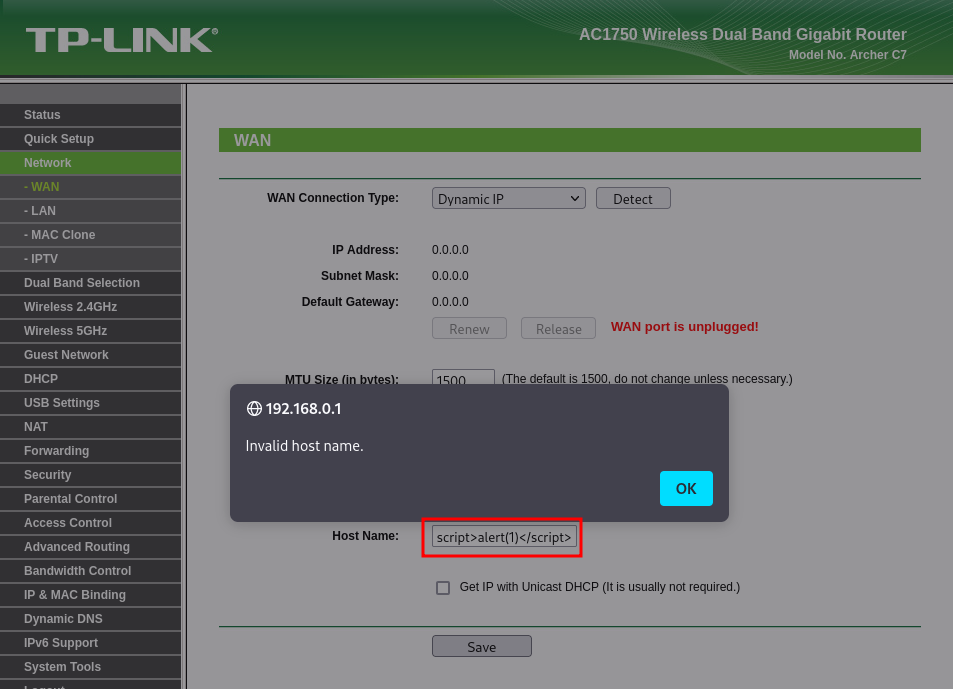
</p>

All tested fields rejected special characters with invalid input errors, preventing script injection. No XSS vulnerability was identified.

### Command Injection

The diagnostic tool under `System Tools → Diagnostic` accepts an IP address or domain name for ping and traceroute operations. Command injection was attempted by appending shell operators and commands to the input, as exemplified in the image below.

<p align="center">
  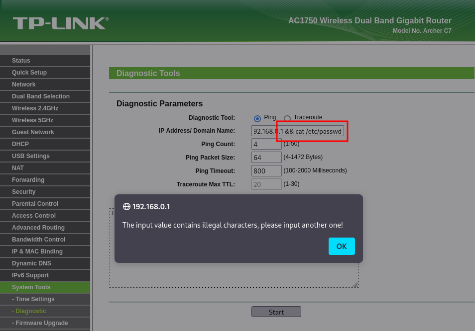
</p>

All attempts were rejected with invalid format errors. The input validation appears to restrict the type of characters that can be used, preventing command injection.

### Authentication Bypass via Direct URL Access

An attempt was made to access internal pages directly without 
authenticating, by navigating to known router interface URLs, such as:

- http://192.168.0.1/userRpm/Index.htm
- http://192.168.0.1/userRpm/ChangeLoginPwdRpm.htm
- http://192.168.0.1/userRpm/NasDiskSettingsRpm.htm

All direct access attempts were redirected to the login page, confirming that authentication is enforced on all endpoints.

### Cross-Site Request Forgery (CSRF)

Analysis of form submissions and request headers revealed several significant findings regarding how the web interface handles authentication and requests, detailed below.

**HTTP Basic Authentication over plain HTTP**: the router uses HTTP Basic Authentication, transmitting credentials in several requests via the Authorization header, as seen below.

<p align="center">
  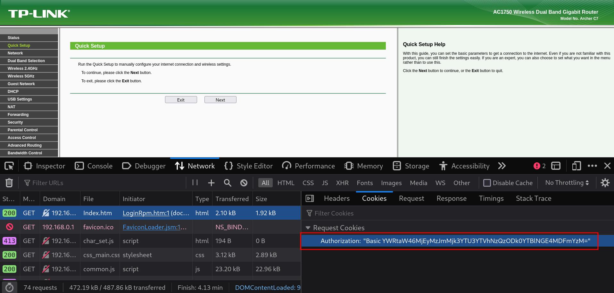
</p>

The value is Base64 encoded, and decodes to `admin:<password_hash>`. Since the interface operates exclusively over plain HTTP with no HTTPS support, these credentials are transmitted in cleartext in the requests and are visible to anyone intercepting network traffic on the same network, since Base64 is a trivially reversible encoding that provides no security benefit.

**Credentials transmitted via GET request**: beyond the Authorization header, sensitive form submissions such as password changes are sent as HTTP GET requests with all parameters appended to the URL, as observed in the Referer header during a password change operation.

<p align="center">
  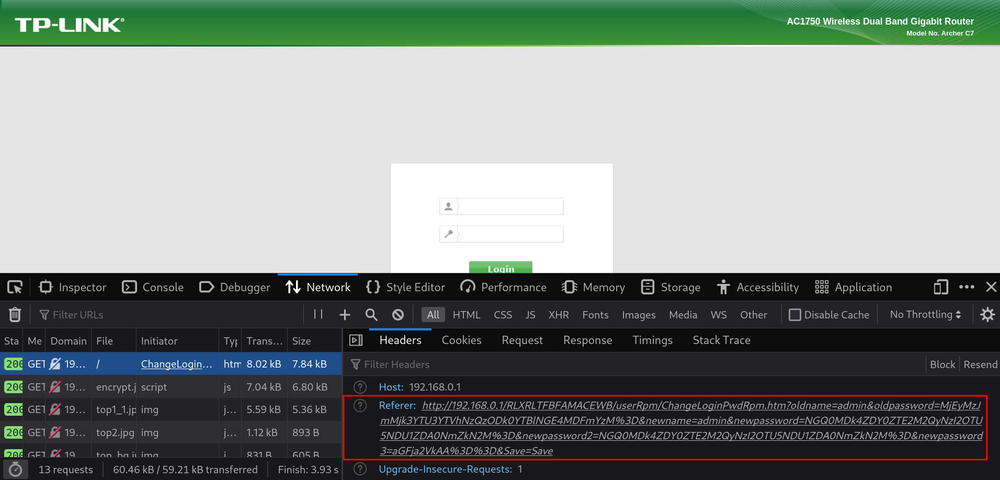
</p>

Transmitting credentials as GET parameters exposes them in browser history, server access logs, and the Referer header sent to any subsequently loaded resource. Further inspection of the GET request preceding this one reveals an [encrypt.js](../5_appendix/5_09_web-interface/encrypt.js) file containing client-side MD5 hashing and Base64 encoding functions, confirming that passwords are hashed using this algorithm and then Base64 encoded before being appended to the URL as a GET parameter.

This was confirmed by capturing network traffic using [Wireshark](https://www.wireshark.org/) during a password change operation. The capture can be seen in the [change_pwd.pcapng](../5_appendix/5_09_web-interface/change_pwd.pcapng) file, which has been filtered so as to only include the communication between the kali attacking machine and the target. The captured packet shows the complete request in plaintext, including the session token and all credential parameters. Decoding the `newpassword3` parameter from Base64 directly reveals the new password in plaintext, demonstrating that credential
exposure is immediately exploitable by anyone capturing traffic on the same network.

<p align="center">
  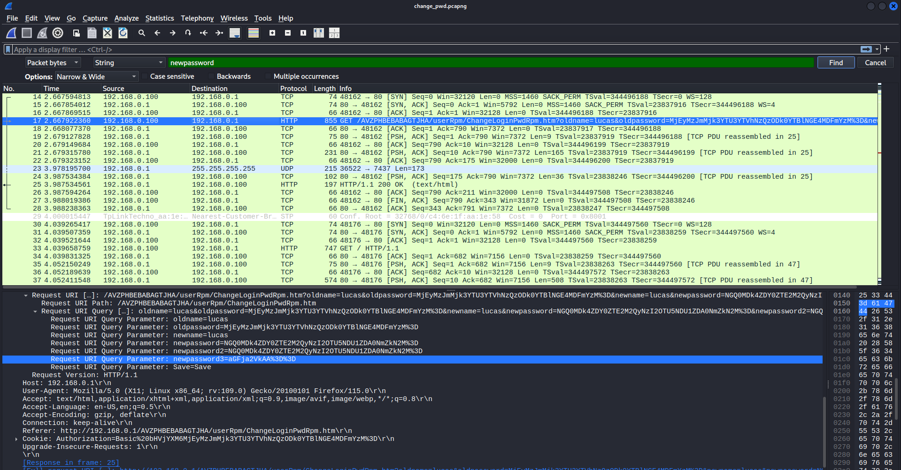
</p>

**Implicit CSRF protection via URL token**: the session token embedded in the URL path (e.g. `http://192.168.0.1/AVZPHBEBABAGTJHA/userRpm/Index.htm`) provides some implicit CSRF protection, as an external attacker cannot easily guess the token value. However this protection is undermined by the use of plain HTTP, which makes the token visible to anyone intercepting network traffic (which can also be seen in the Wireshark capture above).

**Right-click disabled**: the interface disables the browser right-click context menu via JavaScript. While trivially bypassed using browser developer tools or the `view-source:` URL prefix, its presence suggests an attempt to obscure the page source from casual inspection.

## UART monitoring during web interface interaction

The final test executed regarding the web interface consisted of monitoring the UART serial console while performing web interface actions in order to observe potential internal debug output. For this, besides the already connected network cable, the USB-to-TTL serial adapter was also connected between the target and the Kali machine. 

To check if the UART serial console revealed any meaningful information, the web interface login credentials were changed. The observed output, which can be seen below, revealed that configuration changes trigger direct flash memory write operations, with the affected address range visible in the kernel log.

```
[177.648000] Erase from 0XFA0000 to 0XFB1D58
[177.788000] Program from 0XFA0000 to 0XFB1D58
[177.788000] write successfully
```

Although no credentials or debug information were observed in the serial output, every configuration change triggers a direct write to flash memory, which has a finite number of write cycles. This means that an attacker with web interface access could repeatedly modify settings to accelerate flash wear, potentially causing hardware failure over time.