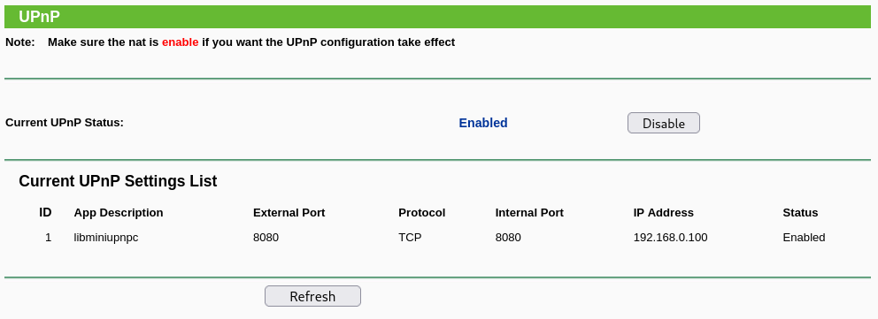

# UPnP Testing

Universal Plug and Play (UPnP) is a network protocol that allows devices on a local network to automatically discover each other and establish functional services. One of its most commonly used features is the ability to dynamically add and remove port forwarding rules on a router, allowing devices such as games consoles or media servers to open ports without manual configuration.

While convenient, UPnP has no built-in authentication mechanism. Therefore, any device on the LAN can interact with the UPnP service and modify port forwarding rules without providing any credentials. This makes it a significant security concern, particularly on devices exposed to untrusted networks.The following sections document the findings identified during UPnP testing.

## Discovery

UPnP was identified during the network scans performed in the [System Hardening Analysis](./3_08_system-hardening-analysis.md) chapter on ports 1900, 49152, and 49153. Furthermore, as noted in the [Web Interface Analysis](./3_09_web-interface.md) chapter, this service was found to be enabled by default on the target.

The `upnpc` command line client was used to interact with UPnP directly. The initial listing command, whose output is provided in the log below, confirmed the UPnP service was accessible and responsive without requiring any authentication.

```
┌──(lucas㉿localhost)-[~]
└─$ upnpc -l
upnpc: miniupnpc library test client, version 2.3.3.
 (c) 2005-2025 Thomas Bernard.
More information at https://miniupnp.tuxfamily.org/ or http://miniupnp.free.fr/

List of UPNP devices found on the network :
 desc: http://192.168.0.1:1900/igd.xml
 st: urn:schemas-upnp-org:device:InternetGatewayDevice:1

Found an IGD with a reserved IP address (0.0.0.0) : http://192.168.0.1:1900/ipc
Local LAN ip address : 192.168.0.100
Connection Type : IP_Routed
Status : Connected, uptime=0s, LastConnectionError : ERROR_NONE
MaxBitRateDown : 100000 bps (100 Kbps)   MaxBitRateUp 100000 bps (100 Kbps)
ExternalIPAddress = 0.0.0.0
 i protocol exPort->inAddr:inPort description remoteHost leaseTime
GetGenericPortMappingEntry() returned 402 (Invalid Args)
```

The target was identified as an Internet Gateway Device (IGD), which is the standard UPnP device type for routers. As seen, no existing port mappings were present at this stage.

## Unauthenticated Port Mapping

To demonstrate the security implications of unauthenticated UPnP access, a complete add, verify, and delete cycle regarding a port forwarding rule was attempted. The result of this process is further detailed in the sections below.

### Adding a Port Mapping

A TCP port forwarding rule was added, redirecting external port 8080 to the internal machine at `192.168.0.100:8080`.

```
┌──(lucas㉿localhost)-[~]
└─$ upnpc -a 192.168.0.100 8080 8080 TCP
upnpc: miniupnpc library test client, version 2.3.3.
 (c) 2005-2025 Thomas Bernard.
More information at https://miniupnp.tuxfamily.org/ or http://miniupnp.free.fr/

List of UPNP devices found on the network :
 desc: http://192.168.0.1:1900/igd.xml
 st: urn:schemas-upnp-org:device:InternetGatewayDevice:1

Found an IGD with a reserved IP address (0.0.0.0) : http://192.168.0.1:1900/ipc
Local LAN ip address : 192.168.0.100
ExternalIPAddress = 0.0.0.0
InternalIP:Port = 192.168.0.100:8080
external 0.0.0.0:8080 TCP is redirected to internal 192.168.0.100:8080 (duration=0)
```

The log above shows that the added rule was accepted and applied immediately with no authentication required.

### Verifying the Port Mapping

A subsequent listing confirmed the rule was active.

```
┌──(lucas㉿localhost)-[~]
└─$ upnpc -l                            
upnpc: miniupnpc library test client, version 2.3.3.
 (c) 2005-2025 Thomas Bernard.
More information at https://miniupnp.tuxfamily.org/ or http://miniupnp.free.fr/

List of UPNP devices found on the network :
 desc: http://192.168.0.1:1900/igd.xml
 st: urn:schemas-upnp-org:device:InternetGatewayDevice:1

Found an IGD with a reserved IP address (0.0.0.0) : http://192.168.0.1:1900/ipc
Local LAN ip address : 192.168.0.100
Connection Type : IP_Routed
Status : Connected, uptime=0s, LastConnectionError : ERROR_NONE
MaxBitRateDown : 100000 bps (100 Kbps)   MaxBitRateUp 100000 bps (100 Kbps)
ExternalIPAddress = 0.0.0.0
 i protocol exPort->inAddr:inPort description remoteHost leaseTime
 0 TCP  8080->192.168.0.100:8080  'libminiupnpc' '' 0
GetGenericPortMappingEntry() returned 402 (Invalid Args)
```

Further confirmation was also obtained by checking the web interface's UPnP submenu, which also listed the added rule, as seen in the image below.

<p align="center">
  
</p>

### Deleting the Port Mapping

The rule was subsequently deleted, also without authentication.

```
┌──(lucas㉿localhost)-[~/embedded-device-pentesting]
└─$ upnpc -d 8080 TCP
upnpc: miniupnpc library test client, version 2.3.3.
 (c) 2005-2025 Thomas Bernard.
More information at https://miniupnp.tuxfamily.org/ or http://miniupnp.free.fr/

List of UPNP devices found on the network :
 desc: http://192.168.0.1:1900/igd.xml
 st: urn:schemas-upnp-org:device:InternetGatewayDevice:1

Found an IGD with a reserved IP address (0.0.0.0) : http://192.168.0.1:1900/ipc
Local LAN ip address : 192.168.0.100
UPNP_DeletePortMapping() returned : 0
```

A final listing confirmed the rule had been successfully removed, leaving the table empty. The same was confirmed on the web interface.

The ability to list, add and remove port forwarding rules without any kind of authentication has been added as a finding.