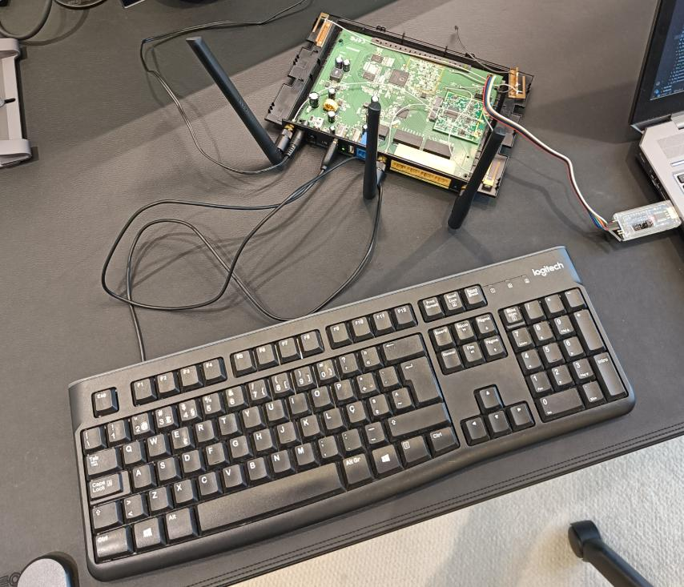
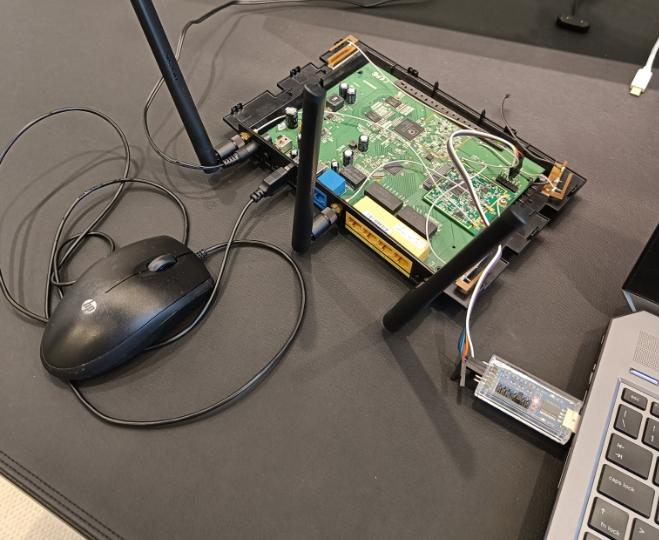
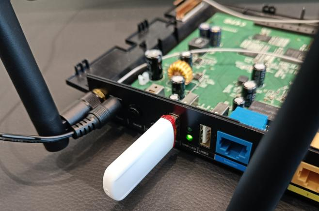
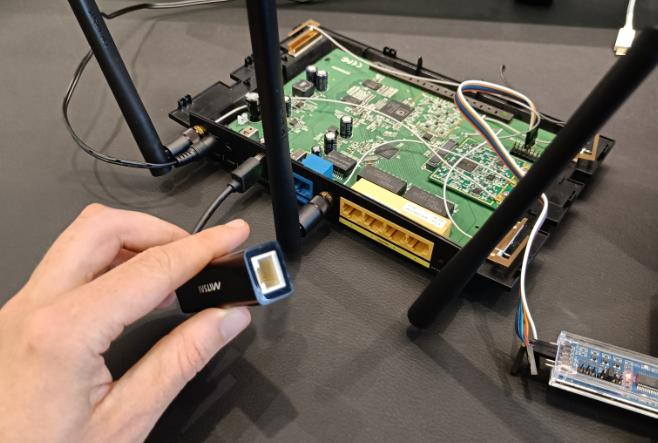
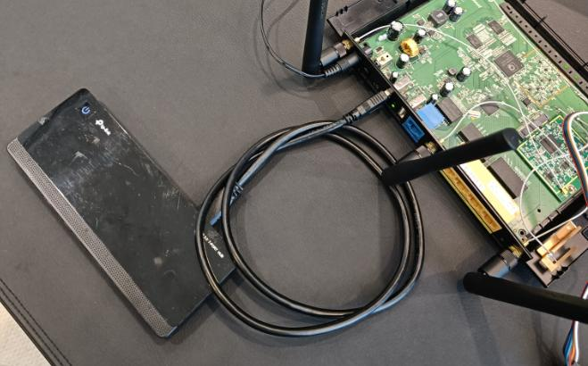

# USB

The router possesses two USB 2.0 ports which, as previously seen in the [Web Interface Analysis](3_10_web-interface.md) section, are intended for NAS functionality via mass storage devices. However, these ports represent a physical attack surface since an attacker with physical access to the device could attempt to exploit USB functionality through several device classes by attempting HID injection, network interface injection, or protocol-level attacks.

Given this context, several devices were connected to the router's USB ports in order to assess its behaviour. The following table summarises the results of this exercise. No device affected the router's normal behaviour.

| Setup | Class ID | Notes |
|--------|----------|-------------|
| Keyboard | 3 | Not supported. Input ignored. |
| Mouse | 3 | Not supported. Input ignored. |
| Rubber ducky | 2, 10, 3 | Not supported. Input ignored. |
| Ethernet adapter | 255 | Not supported. No new network interfaces shown |
| Hub (solo) | - | Correctly enumerated. |
| Hub (concurrent devices) | - | Hub enumerated. End devices not supported. |
| Hot plugging | - | Hub enumerated. End devices not recognized. |

The behaviour of the router was observed by monitoring its kernel messages through a UART root shell. The following subsections illustrate the setup of each device(s) alongside the corresponding kernel log captured during its connection and disconnection to and from the router's ports.

## Keyboard

### Setup
<p align="center">
  
</p>

### Log
```
[  247.916000] usb 2-1: new low speed USB device using ath-ehci1 and address 2
[  248.064000] usb 2-1: Unsupported USB devices bInterfaceClass 3
[  248.068000] usb 2-1: configuration #1 chosen from 1 choice
[  248.080000] INFO008C: Add device intf 85c71ee0, dev 866f5800
[  248.084000] INFO05D5:  dev bus_id 2-1 
[  248.088000] INFO05D6:  control driver ath-ehci1
[  248.092000] INFO05D7:  bInterfaceClass 3 
[  248.096000] INFO0601:  dev 866f5800 : dev->actconfig->desc.bNumInterfaces 2 
[  248.108000] INFO008C: Add device intf 85c71de0, dev 866f5800
[  248.112000] INFO05D5:  dev bus_id 2-1 
[  248.116000] INFO05D6:  control driver ath-ehci1
[  248.120000] INFO05D7:  bInterfaceClass 3 
[  253.428000] usb 2-1: USB disconnect, address 2
[  253.432000] INFO009A: Remove device intf 85c71ee0, dev 866f5800
[  253.440000] INFO01D5: USBLocalBroker_disconnect
[  253.444000] INFO009A: Remove device intf 85c71de0, dev 866f5800
[  253.452000] <3>NERR0661: khubd     : deviceInfo = NULL
```

Upon connection the router identified the device as USB class 3 (HID) but immediately rejected it with `Unsupported USB devices bInterfaceClass 3`, confirming no HID driver is present. No input processing occurred. Also, a `<3>NERR0661: khubd     : deviceInfo = NULL` error was also seen upon disconnection of the device.

## Mouse

### Setup

<p align="center">
  
</p>

### Log
```
[  331.864000] usb 2-1: new low speed USB device using ath-ehci1 and address 3
[  332.008000] usb 2-1: Unsupported USB devices bInterfaceClass 3
[  332.016000] usb 2-1: configuration #1 chosen from 1 choice
[  332.020000] INFO008C: Add device intf 85c73180, dev 866f5800
[  332.028000] INFO05D5:  dev bus_id 2-1 
[  332.032000] INFO05D6:  control driver ath-ehci1
[  332.036000] INFO05D7:  bInterfaceClass 3 
[  332.040000] INFO0601:  dev 866f5800 : dev->actconfig->desc.bNumInterfaces 1 
[  336.880000] usb 2-1: USB disconnect, address 3
[  336.888000] INFO009A: Remove device intf 85c73180, dev 866f5800
[  336.892000] INFO01D5: USBLocalBroker_disconnect
```

Upon connection the router identified the device as USB class 3 (HID) but immediately rejected it with `Unsupported USB devices bInterfaceClass 3`, confirming no HID driver is present. No input processing occurred. Furthermore, contrary to the keyboard, the mouse disconnected cleanly from the router.

## Rubber ducky

### Setup

<p align="center">
  
</p>

### Log

```
[  463.460000] usb 2-1: new full speed USB device using ath-ehci1 and address 5
[  463.612000] usb 2-1: Unsupported USB devices bInterfaceClass 2
[  463.616000] usb 2-1: configuration #1 chosen from 1 choice
[  463.624000] INFO008C: Add device intf 85c4ce80, dev 866f5800
[  463.628000] INFO05D5:  dev bus_id 2-1 
[  463.632000] INFO05D6:  control driver ath-ehci1
[  463.636000] INFO05D7:  bInterfaceClass 2 
[  463.644000] INFO0601:  dev 866f5800 : dev->actconfig->desc.bNumInterfaces 3 
[  463.648000] INFO008C: Add device intf 85c4cd80, dev 866f5800
[  463.656000] INFO05D5:  dev bus_id 2-1 
[  463.660000] INFO05D6:  control driver ath-ehci1
[  463.664000] INFO05D7:  bInterfaceClass 10 
[  463.668000] INFO008C: Add device intf 85c4cc80, dev 866f5800
[  463.672000] INFO05D5:  dev bus_id 2-1 
[  463.676000] INFO05D6:  control driver ath-ehci1
[  463.684000] INFO05D7:  bInterfaceClass 3 
[  468.964000] usb 2-1: USB disconnect, address 5
[  468.968000] INFO009A: Remove device intf 85c4ce80, dev 866f5800
[  468.976000] INFO01D5: USBLocalBroker_disconnect
[  468.980000] INFO009A: Remove device intf 85c4cd80, dev 866f5800
[  468.984000] <3>NERR0661: khubd     : deviceInfo = NULL
[  468.992000] INFO009A: Remove device intf 85c4cc80, dev 866f5800
[  468.996000] <3>NERR0661: khubd     : deviceInfo = NULL
```

Identified with class `2`, `10` and `3` (CDC, CDC Data and HID, respectively) as it is a composite device by design, but rejected by the router. `NERR0661` USB disconnection errors noted. 

## Ethernet adapter

### Setup

<p align="center">
  
</p>

### Log

```
[  401.128000] usb 2-1: new high speed USB device using ath-ehci1 and address 4
[  401.264000] usb 2-1: Unsupported USB devices bInterfaceClass 255
[  401.268000] usb 2-1: configuration #2 chosen from 2 choices
[  401.276000] INFO008C: Add device intf 85c5e0e0, dev 866f5400
[  401.284000] INFO05D5:  dev bus_id 2-1 
[  401.284000] INFO05D6:  control driver ath-ehci1
[  401.292000] INFO05D7:  bInterfaceClass 2 
[  401.296000] INFO0601:  dev 866f5400 : dev->actconfig->desc.bNumInterfaces 2 
[  401.300000] INFO008C: Add device intf 85c5e1e0, dev 866f5400
[  401.308000] INFO05D5:  dev bus_id 2-1 
[  401.312000] INFO05D6:  control driver ath-ehci1
[  401.316000] INFO05D7:  bInterfaceClass 10 
[  404.536000] usb 2-1: USB disconnect, address 4
[  404.540000] INFO009A: Remove device intf 85c5e0e0, dev 866f5400
[  404.548000] INFO01D5: USBLocalBroker_disconnect
[  404.552000] INFO009A: Remove device intf 85c5e1e0, dev 866f5400
[  404.560000] <3>NERR0661: khubd     : deviceInfo = NULL
```

The router identified the class of device connected (`255`, which seems to be vendor specific) but rejected it as not supported. Furthermore, in this situation, an `ifconfig` command was run before and after the connection of the device but yielded no new network interface (see the log [here](../5_appendix/5_12_usb/screenlog.0)). The same `NERR0661` disconnection error can also be noted.

## Hub

### Setup (solo)

<p align="center">
  
</p>

### Log
```
[  506.124000] usb 2-1: new high speed USB device using ath-ehci1 and address 6
[  506.272000] usb 2-1: configuration #1 chosen from 1 choice
[  506.280000] hub 2-1:1.0: USB hub found
[  506.284000] hub 2-1:1.0: 4 ports detected
[  506.580000] usb 2-1.1: new high speed USB device using ath-ehci1 and address 7
[  506.704000] usb 2-1.1: configuration #1 chosen from 1 choice
[  506.712000] hub 2-1.1:1.0: USB hub found
[  506.720000] hub 2-1.1:1.0: 4 ports detected
[  511.788000] usb 2-1: USB disconnect, address 6
[  511.792000] usb 2-1.1: USB disconnect, address 7
```

In this case, the hub was correctly enumerated, with the cascaded internal hub also detected, producing no errors on connection or disconnection.

### Setup (concurrent devices)

<p align="center">
  
</p>

### Log
```
[  147.864000] usb 2-1: new high speed USB device using ath-ehci1 and address 2
[  148.012000] usb 2-1: configuration #1 chosen from 1 choice
[  148.020000] hub 2-1:1.0: USB hub found
[  148.024000] hub 2-1:1.0: 4 ports detected
[  148.320000] usb 2-1.1: new high speed USB device using ath-ehci1 and address 3
[  148.444000] usb 2-1.1: configuration #1 chosen from 1 choice
[  148.452000] hub 2-1.1:1.0: USB hub found
[  148.456000] hub 2-1.1:1.0: 4 ports detected
[  148.752000] usb 2-1.1.1: new low speed USB device using ath-ehci1 and address 4
[  148.956000] usb 2-1.1.1: Unsupported USB devices bInterfaceClass 3
[  148.964000] usb 2-1.1.1: configuration #1 chosen from 1 choice
[  148.972000] INFO008C: Add device intf 866a0c80, dev 85c04000
[  148.976000] INFO05D5:  dev bus_id 2-1.1.1 
[  148.980000] INFO05D6:  control driver ath-ehci1
[  148.988000] INFO05D7:  bInterfaceClass 3 
[  148.992000] INFO0601:  dev 85c04000 : dev->actconfig->desc.bNumInterfaces 2 
[  149.000000] INFO008C: Add device intf 866a0b80, dev 85c04000
[  149.004000] INFO05D5:  dev bus_id 2-1.1.1 
[  149.008000] INFO05D6:  control driver ath-ehci1
[  149.012000] INFO05D7:  bInterfaceClass 3 
[  149.092000] usb 2-1.1.2: new low speed USB device using ath-ehci1 and address 5
[  149.296000] usb 2-1.1.2: Unsupported USB devices bInterfaceClass 3
[  149.300000] usb 2-1.1.2: configuration #1 chosen from 1 choice
[  149.308000] INFO008C: Add device intf 866a0a80, dev 867e1800
[  149.312000] INFO05D5:  dev bus_id 2-1.1.2 
[  149.316000] INFO05D6:  control driver ath-ehci1
[  149.324000] INFO05D7:  bInterfaceClass 3 
[  149.328000] INFO0601:  dev 867e1800 : dev->actconfig->desc.bNumInterfaces 1 
[  149.408000] usb 2-1.1.3: new full speed USB device using ath-ehci1 and address 6
[  149.512000] usb 2-1.1.3: Unsupported USB devices bInterfaceClass 2
[  149.520000] usb 2-1.1.3: configuration #1 chosen from 1 choice
[  149.528000] INFO008C: Add device intf 866a0980, dev 867e1000
[  149.532000] INFO05D5:  dev bus_id 2-1.1.3 
[  149.536000] INFO05D6:  control driver ath-ehci1
[  149.540000] INFO05D7:  bInterfaceClass 2 
[  149.544000] INFO0601:  dev 867e1000 : dev->actconfig->desc.bNumInterfaces 3 
[  149.552000] INFO008C: Add device intf 866a0880, dev 867e1000
[  149.560000] INFO05D5:  dev bus_id 2-1.1.3 
[  149.564000] INFO05D6:  control driver ath-ehci1
[  149.568000] INFO05D7:  bInterfaceClass 10 
[  149.572000] INFO008C: Add device intf 866a0780, dev 867e1000
[  149.576000] INFO05D5:  dev bus_id 2-1.1.3 
[  149.584000] INFO05D6:  control driver ath-ehci1
[  149.588000] INFO05D7:  bInterfaceClass 3 
[  192.672000] usb 2-1: USB disconnect, address 2
[  192.676000] usb 2-1.1: USB disconnect, address 3
[  192.684000] usb 2-1.1.1: USB disconnect, address 4
[  192.688000] INFO009A: Remove device intf 866a0c80, dev 85c04000
[  192.692000] INFO01D5: USBLocalBroker_disconnect
[  192.696000] INFO009A: Remove device intf 866a0b80, dev 85c04000
[  192.704000] usb 2-1.1.2: USB disconnect, address 5
[  192.708000] INFO009A: Remove device intf 866a0a80, dev 867e1800
[  192.716000] INFO01D5: USBLocalBroker_disconnect
[  192.720000] usb 2-1.1.3: USB disconnect, address 6
[  192.724000] INFO009A: Remove device intf 866a0980, dev 867e1000
[  192.732000] INFO01D5: USBLocalBroker_disconnect
[  192.736000] INFO009A: Remove device intf 866a0880, dev 867e1000
[  192.744000] <3>NERR0661: khubd     : deviceInfo = NULL
[  192.748000] INFO009A: Remove device intf 866a0780, dev 867e1000
[  192.752000] <3>NERR0661: khubd     : deviceInfo = NULL
```

In this case, the obtained output log was expected as it consisted of a combination of the previous individual logs seen when connecting the solo hub, keyboard, mouse and rubber ducky (which were the devices connected to the hub).

## Hot plugging dock with various devices

With the last setup shown (USB hub with multiple devices), the hub was quickly connected (with devices already attached) and subsequently disconnected to check how the router would handle this situation. As seen in the log below, the hub is correctly enumerated while the concurrent devices could not be recognized, returning various `err = -71` errors.

```
[  348.688000] usb 2-1: new high speed USB device using ath-ehci1 and address 7
[  348.836000] usb 2-1: configuration #1 chosen from 1 choice
[  348.844000] hub 2-1:1.0: USB hub found
[  348.848000] hub 2-1:1.0: 4 ports detected
[  349.100000] hub 2-1:1.0: hub_port_status failed (err = -71)
[  349.140000] hub 2-1:1.0: cannot reset port 1 (err = -71)
[  349.176000] hub 2-1:1.0: cannot reset port 1 (err = -71)
[  349.212000] hub 2-1:1.0: cannot reset port 1 (err = -71)
[  349.248000] hub 2-1:1.0: cannot reset port 1 (err = -71)
[  349.256000] hub 2-1:1.0: Cannot enable port 1.  Maybe the USB cable is bad?
[  349.292000] hub 2-1:1.0: cannot disable port 1 (err = -71)
[  349.332000] hub 2-1:1.0: cannot reset port 1 (err = -71)
[  349.368000] hub 2-1:1.0: cannot reset port 1 (err = -71)
[  349.404000] hub 2-1:1.0: cannot reset port 1 (err = -71)
[  349.440000] hub 2-1:1.0: cannot reset port 1 (err = -71)
[  349.480000] hub 2-1:1.0: cannot reset port 1 (err = -71)
[  349.484000] hub 2-1:1.0: Cannot enable port 1.  Maybe the USB cable is bad?
[  349.524000] hub 2-1:1.0: cannot disable port 1 (err = -71)
[  349.560000] hub 2-1:1.0: cannot reset port 1 (err = -71)
[  349.596000] hub 2-1:1.0: cannot reset port 1 (err = -71)
[  349.632000] hub 2-1:1.0: cannot reset port 1 (err = -71)
[  349.672000] hub 2-1:1.0: cannot reset port 1 (err = -71)
[  349.708000] hub 2-1:1.0: cannot reset port 1 (err = -71)
[  349.712000] hub 2-1:1.0: Cannot enable port 1.  Maybe the USB cable is bad?
[  349.752000] hub 2-1:1.0: cannot disable port 1 (err = -71)
[  349.788000] hub 2-1:1.0: cannot reset port 1 (err = -71)
[  349.824000] hub 2-1:1.0: cannot reset port 1 (err = -71)
[  349.864000] hub 2-1:1.0: cannot reset port 1 (err = -71)
[  349.900000] hub 2-1:1.0: cannot reset port 1 (err = -71)
[  349.936000] hub 2-1:1.0: cannot reset port 1 (err = -71)
[  349.940000] hub 2-1:1.0: Cannot enable port 1.  Maybe the USB cable is bad?
[  349.980000] hub 2-1:1.0: cannot disable port 1 (err = -71)
[  349.984000] hub 2-1:1.0: unable to enumerate USB device on port 1
[  350.024000] hub 2-1:1.0: cannot disable port 1 (err = -71)
[  350.028000] usb 2-1: USB disconnect, address 7
```