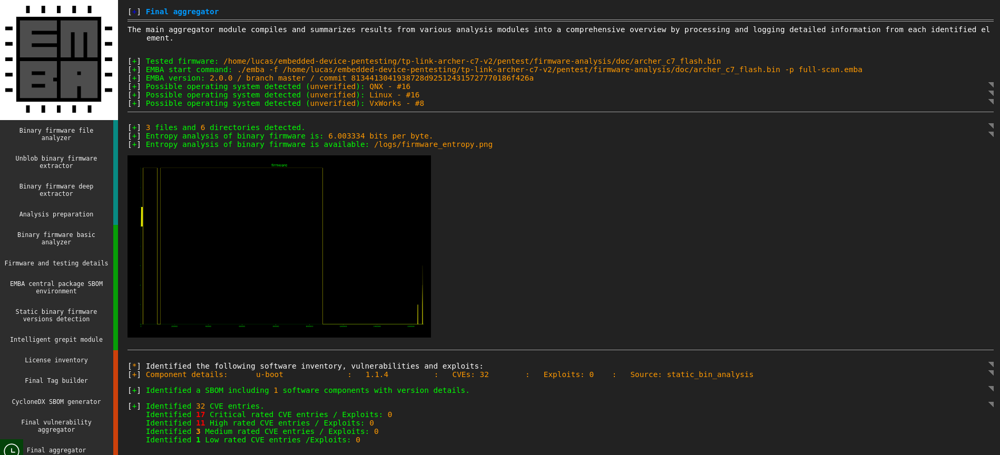
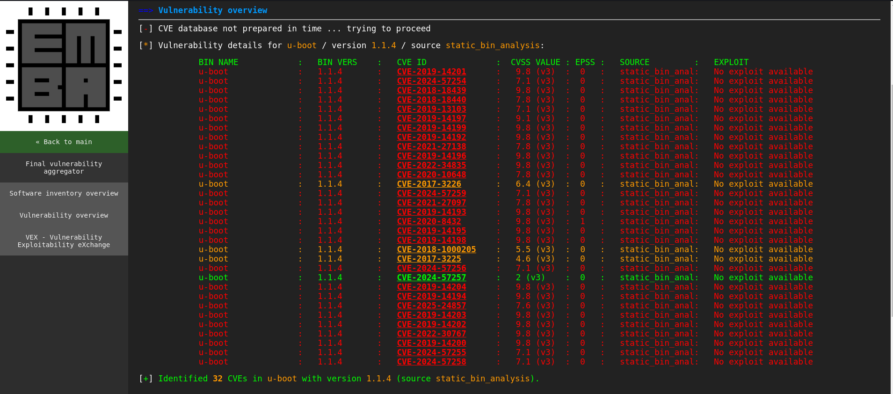
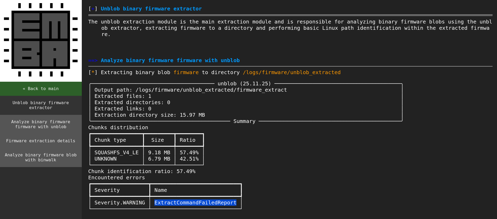

# Firmware analysis

Having obtained the firmware through the process previously detailed in [firmware extraction](5_1_firmware-extraction.md), the next step consisted in analysing it. This process was conducted in an automated and manual manner. 

## Automated firmware analysis

The automated analysis was done via [EMBA](https://github.com/e-m-b-a/emba), an embedded firmware security analyzer for penetration testers. 
EMBA assists in the identification of possible vulnerabilities in the firmware, providing a potential overview on the existing attack surface. This information can then be used by penetration testers in order to ascertain which focus areas are the most relevant for further investigation.

Since EMBA is a command line tool, the first step in order to achieve automated firmware analysis (apart from the download of the tool itself) was to select which binary was to be analyzed and what scan profile to use, the latter choice allowing for shallower/deeper analysis of the firmware by means of disabling/enabling different modules. In this case, these consisted of the already extracted [binary](doc/archer_c7_flash.bin) and the full scan profile, respectively. This can be translated as the following command, executed from the emba repository:

```
$ ./emba -f /home/lucas/archer_c7_flash.bin -p full-scan.emba
```

Once finished, EMBA produces an HTML report which can be viewed in a browser, as can be seen in the image provided below.

<p align="center">
  
</p>

As seen, EMBA's final aggregator presents information regarding:

1. Possible detected operating systems associated to the firmware
2. Firmware entropy analysis
3. Summary of existent CVEs associated with the specific firmware version

One point of interest are the CVEs associated with the firmware. These are publicly exposed vulnerabilities which could constitute weak spots in the device's firmware and could later be used in order to exploit the target. The image below illustrates the specific CVEs in detail.

<p align="center">
  
</p>

All but one of the CVEs present an EPSS score of 0, meaning that it is not probable that the vulnerabilities will be exploited. However,
[CVE-2020-8432](https://nvd.nist.gov/vuln/detail/CVE-2020-8432) was the only CVE with a non-zero EPSS score, suggesting a slightly elevated probability of real-world exploitation compared to the others.

## Manual firmware analysis

While automated analysis provides broad coverage of a firmware image, it is inherently limited by the tools and configurations it employs. As such, a manual analysis was conducted to complement and verify EMBA's findings.

The first observation that was made regarding EMBA's results was that its S45 module, used for searching password files, reported no found password files at all, as seen in the output below.

```
┌──(lucas㉿localhost)-[~/tools/emba/logs]
└─$ cat s45_pass_file_check.txt
[+] Search password files
=================================================================
This module tries to identify password related files and analyses found password files for hashes, users and other configuration weaknesses.


[-] No password files found
[-] Mon Mar 16 22:16:39 UTC 2026 - S45_pass_file_check nothing reported
```

This was noted as suspicious and prompted a broader look at EMBA's S module results as a whole. Upon further investigation, the observed results were considerably sparse, leading to the conclusion that the file system extraction from the firmware binary was not successful. Checking EMBA's P55 Unblob firmware extractor and P60 Binary firmware extractor modules confirmed this with several logged `ExtractCommandFailedReport` warnings, as exemplified below.

<p align="center">
  
</p>

Therefore, the extraction of the file system from the binary was attempted manually with numerous tools, such as:

- **binwalk**: identified the firmware structure and located a SquashFS 
filesystem (LZMA compressed), but produced an empty `squashfs-root` directory upon extraction.
- **unsquashfs**: attempted directly on the extracted SquashFS image, 
returning a fatal filesystem corruption error.
- **sasquatch**: a SquashFS extraction tool specifically designed for 
embedded firmware variants, also returned the same filesystem corruption error.
- **firmware-mod-kit**: successfully parsed the firmware structure and 
isolated a `rootfs.img`, however subsequent extraction with unsquashfs 
produced the same corruption error as above.

The fatal error mentioned above is presented in the following output.

```
Lseek failed because Invalid argument
read_block: failed to read block @0xffffffffffffffff
read_id_table: failed to read id table block
FATAL ERROR: File system corruption detected
```

The consistent appearance of this error suggests that the target's manufacturer (TP-Link) likely employs a proprietary LZMA-compressed SquashFS variant that is not compatible with standard extraction tooling.

At this point, having been unable to extract the filesystem from the captured binary, the publicly available vendor [GPL code](https://www.tp-link.com/pt/support/download/archer-c7/v2/#GPL-Code) for the Archer C7 was used as a cross-reference. Within the code, the `/etc/shadow` file was located, enabling the identification and extraction of the root password hash. The hash prefix was `$1$`, allowing to identify it as MD5-based (md5crypt), which is a weak hashing algorithm by modern standards. It was subsequently submitted to an [online rainbow table lookup service](https://hashes.com/en/decrypt/hash) where a match was found, as seen in the image below, revealing a seven character plaintext password. The hash and password have been obscured for responsible disclosure purposes, as publishing either value could enable third parties to compromise devices running this firmware without authorisation.

<p align="center">
  
</p>

This highlights two issues: the use of a weak hashing algorithm for credential storage, and the use of a short, weak default password.

To verify the credentials against the target device, the router was connected via USB-to-TTL and the UART output was monitored as previously described in [boot and runtime analysis](../4_boot-and-runtime-analysis/boot-and-runtime-analysis.md). Upon the appearance of the login prompt, the recovered credentials were entered and root access was successfully obtained, as seen below.

<p align="center">
  
</p>

It should be noted that the vendor GPL code contained a minor discrepancy regarding its corresponding hardware revision, which was listed as `ap136`. The previously performed [boot and runtime analysis](../4_boot-and-runtime-analysis/boot-and-runtime-analysis.md) showed that the target identified itself as `ap135`. The fact that credentials are shared across hardware revisions of this device could potentially broaden the impact of this finding to other units.