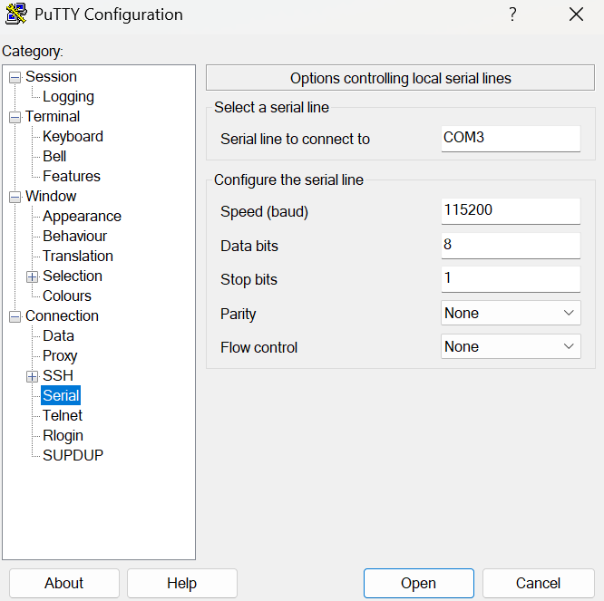
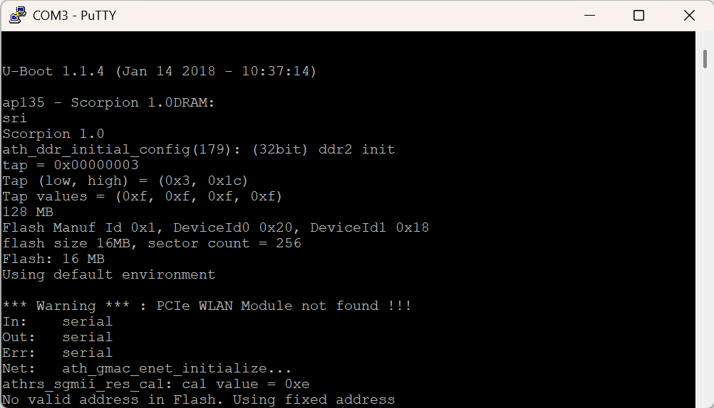

# Boot and Runtime Analysis

This section documents observations made after gaining access to the device’s serial console via the previously identified [UART interface](../interface-discovery/UART.md). 

The goal of this phase was to analyze the boot process, observe bootloader behavior, and assess runtime console access once the system had fully initialized.

## Serial Console Setup

Following the UART interface discovery and the connection of the USB-to-TTL serial adapter between the router and my computer a serial terminal session was opened. In this specific case I used [PuTTY](https://putty.org/index.html) with the following configuration:

  

This configuration corresponds to the standard 8N1 UART setup commonly used by embedded Linux devices.

## Boot Process Observation

With the serial terminal active, the router was power-cycled to capture boot output. Serial output was immediately observed, confirming an active console during early boot. 

  

The output indicated the presence of a U-Boot bootloader and included a message indicating an automatic boot sequence:

*Autobooting in 1 seconds*

Repeated attempts were made to interrupt the boot process by sending input to the console before and during the autoboot countdown. These attempts were unsuccessful, and the system proceeded to boot normally, suggesting that bootloader interruption via the serial console is disabled or restricted.

## Runtime Console Behavior

After the system completed booting, additional serial output was observed. Pressing any key at the end of the boot sequence caused the device to present a login prompt:

*Archer C7 login:*

This indicates that the serial console remains active at runtime and exposes an authentication prompt rather than dropping directly into a shell.

Several common default credentials were tested at the serial login prompt, including combinations of `root` and `admin`. All attempted credentials were rejected, and no authenticated access was obtained via the serial console.

## Captured Output

The full serial output captured during boot and runtime interaction has been preserved for reference and is available [here](doc/putty.log). The log includes the autoboot behavior as well as the authentication attempts I unsuccessfully tried (these are at the end of the file).