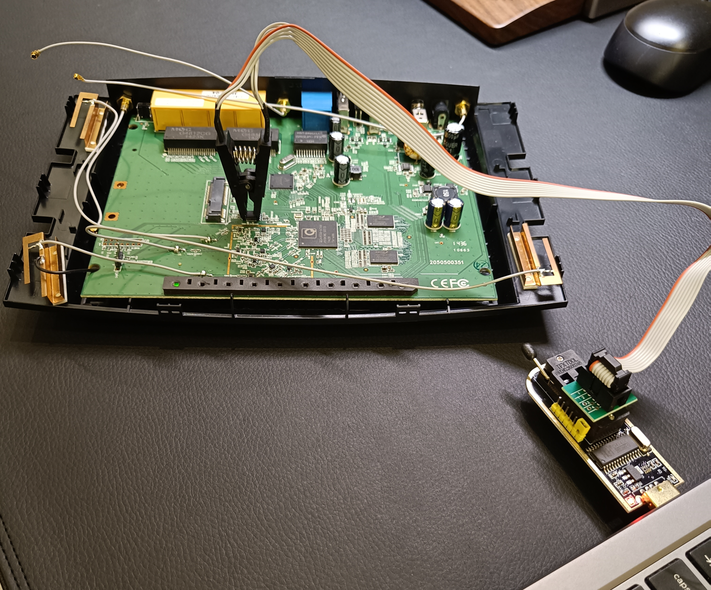

# Firmware extraction

In order to be able to analyse the router's firmware we must first obtain it. This section details my attempts at extracting the router's firmware from the S25FL127 flash chip, previously identified on the router's PCB in the [hardware analysis](../hardware-analysis/hardware-analysis.md) section.

This was attempted in three ways, namely via a: 

- CH341A programmer and test clip
- TFTP server and U-Boot
- UART flash dump via U-Boot

All of these attempts are detailed in the subsections below in this order. 

## CH341A programmer and test clip

In this attempt at extracting the firmware I used a SOIC8 test clip attached to the flash memory and connected it to a CH341A programmer which itself connected to my Kali Linux workstation as can be seen in the image below.

<p align="center">
  
</p>

On the workstation side, the `flashrom` utility was installed and used to attempt a direct read of the SPI flash. For this, the following command was executed:

```
$ sudo flashrom -p ch341a_spi -r archer_c7_flash.bin
```

Where the `-p ch341a_spi` parameter specifies the CH341A SPI interface, and `-r` instructs flashrom to read the contents of the chip into a file to be named `archer_c7_flash.bin`. Furthermore, before running the command, the following checklist was followed to verify the setup's correctness:

- Pin 1 alignment throughout the setup (from the chip to the programmer) 
- Ensure robust connection/contact between the clip and the chip
- Ensure router was powered off during extraction
- Flash chip model is supported by `flashrom` 

However, despite these checks, the extraction attempt failed. Flashrom consistently returned:

```
flashrom unknown on Linux 6.8.11-amd64 (x86_64)
flashrom is free software, get the source code at https://flashrom.org

Using clock_gettime for delay loops (clk_id: 1, resolution: 1ns).
No EEPROM/flash device found.
Note: flashrom can never write if the flash chip isn't found automatically.
```

## TFTP server and U-Boot

A second attempt at extracting the firmware was performed via the router's U-Boot bootloader. As previously seen in the [boot and runtime analysis](../boot-and-runtime-analysis/boot-and-runtime-analysis.md), it was possible to obtain a U-Boot console prompt (`ap135>`), allowing low level interaction with the device.

With this type of access, a common approach to firmware extraction is to copy the flash contents to RAM and then upload the memory contents to a host machine using a TFTP server. This requires the `tftpput` command to be available in the U-Boot environment.

To determine whether this command was supported, the available commands were listed using the `help` command:

```
ap135> help
? - alias for 'help'
bootm - boot application image from memory
cp - memory copy
crc32 - checksum calculation
erase - erase FLASH memory
flinfo - print FLASH memory information
go - start application at address 'addr'
help - print online help
md - memory display
mm - memory modify (auto-incrementing)
mw - memory write (fill)
nm - memory modify (constant address)
printenv - print environment variables
progmac - Set ethernet MAC addresses
protect - enable or disable FLASH write protection
reset - Perform RESET of the CPU
setenv - set environment variables
tftpboot - boot image via network using TFTP protocol
version - print monitor version
```

While the `tftpboot` command was present, which allows downloading files from a TFTP server to the device, the corresponding `tftpput` command (used for uploading memory contents to a remote server) was not available. Since the goal was to transfer the firmware from the router to the workstation, the absence of `tftpput` rendered this extraction approach impractical. As a result, the firmware could not be extracted using this network-based method.

## UART flash dump via U-Boot

As a final attempt, the firmware was extracted by dumping the flash contents over the UART interface using U-Boot commands. This approach was used as a last resort because it is significantly slower than the previous methods, but it does not rely on additional bootloader features such as TFTP upload functionality.

First, the contents of the SPI flash were copied into the router's RAM. This was necessary because the `md` (memory display) command used later operates on RAM addresses rather than directly on flash memory. The copy was performed using the following command:

```
ap135> cp.b 0x9f000000 0x81000000 0x1000000
```

The parameters of this command are as follows:

- `cp.b` - Copy memory using byte-sized operations  
- `0x9f000000` - Starting address of the SPI flash memory  
- `0x81000000` - Destination address in RAM  
- `0x1000000` - Number of bytes to copy (16 MB)

The value `0x1000000` corresponds to the total size of the SPI flash chip (16 MB). This size was confirmed both from the flash memory datasheet and by summing the partition sizes reported in the U-Boot environment (which can also be seen in the [boot and runtime analysis section](../boot-and-runtime-analysis/boot-and-runtime-analysis.md) in the output of the `printenv` command):

```
bootargs=console=ttyS0,115200 root=31:02 rootfstype=jffs2 init=/sbin/init mtdparts=ath-nor0:256k(u-boot),64k(u-boot-env),6336k(rootfs),1408k(uImage),8256k(mib0),64k(ART)
```

After copying the flash contents to RAM, a serial session was opened on the Kali workstation using:

```
$ screen -L /dev/ttyUSB0 115200
```

The `screen` utility opens a serial terminal connected to the USB-TTL adapter. The `-L` option enables logging, meaning that all data printed to the terminal is automatically written to a file named `screenlog.0`. This allows the firmware data printed by the router to be captured directly on the workstation.

Once logging was enabled, the flash contents stored in RAM were dumped over the UART interface using the following command:

```
ap135> md.b 0x81000000 0x1000000
```


The parameters of this command are:

- `md.b` — Display memory contents in byte format  
- `0x81000000` — Starting RAM address containing the copied flash contents  
- `0x1000000` — Number of bytes to display (16 MB)

This command caused U-Boot to sequentially print the entire flash memory contents in hexadecimal format over the UART interface. Because the serial terminal logging feature was enabled, the output was automatically captured in the [screenlog.0](doc/screenlog.0) file on the workstation.

Although this process is considerably slower than direct flash extraction methods, it successfully produced a complete dump of the router's SPI flash memory, which could then be reconstructed into a binary firmware image for further analysis. This is done in the [firmware analysis](firmware-analysis.md) section.