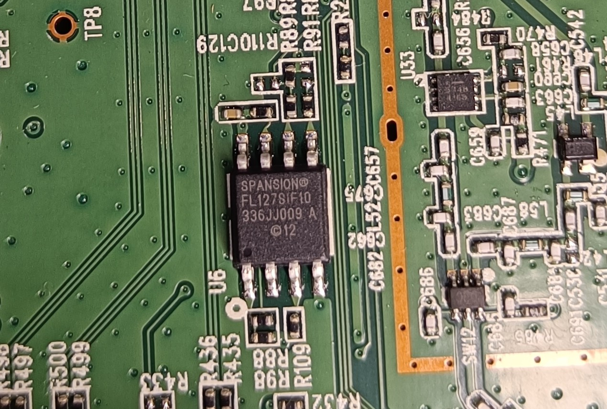

# Hardware overview

## Exterior

AC Wireless Dual Band Gigabit Router

## PCB overview

Single main PCB with Wi-Fi module

## System-on-Chip (SoC)

- Model: Qualcomm Atheros QCA9558-AT4A
- Source: 
    - Chip marking on PCB
    - OpenWRT Wiki (https://openwrt.org/toh/tp-link/archer_c7)

  

## CPU Architecture

- Architecture: MIPS 74Kc 
- Source: 
    - Datasheet ([Qualcomm QCA9558-AT4A SoC datasheet](https://www.google.com/url?sa=t&source=web&rct=j&opi=89978449&url=https://techship.com/download/compex-wpj558-embedded-board-datasheet/&ved=2ahUKEwjDn8Twx4GSAxXyc_EDHb0XFaEQFnoECBkQAQ&usg=AOvVaw0LKJ0E-TDXdrRUrl_8_ZSq))

## RAM 

- Model: 2 x Zentel A3R12E40CBF DDR2 SDRAM
- Size: 2 x 512Mb density (64MB) = 128MB
    - Chip marking on PCB
    - Datasheet ([Zentel A3R12E40CBF DDR2 SDRAM datasheet](https://www.google.com/url?sa=t&source=web&rct=j&opi=89978449&url=https://zentel-europe.com/datasheets/A3R12E340CBF_I_%2520v1.0.pdf&ved=2ahUKEwjCvKLW14GSAxU6iP0HHYjbDI0QFnoECBoQAQ&usg=AOvVaw2L8HFFasAuK5F2O4c32v0K))
    - Source: OpenWRT Wiki (https://openwrt.org/toh/tp-link/archer_c7)

  

## Flash memory

- Model: Spansion S25FL127S
- Size: 16 MB
    - Chip marking on PCB
    - Datasheet ([Spansion S23FL127S flash memory datasheet](https://www.google.com/url?sa=t&source=web&rct=j&opi=89978449&url=https://www.infineon.com/dgdl/Infineon-S25FL127S_128-Mb_(16_MB)_3.0_V_SPI_Flash_Memory-DataSheet-v11_00-EN.pdf%3FfileId%3D8ac78c8c7d0d8da4017d0ecfa58c49f7&ved=2ahUKEwjvmuSj14GSAxUeiv0HHUn9KkMQFnoECA0QAQ&usg=AOvVaw3GZWKDnRwKq120UAr0aQL1))
    - Source: OpenWRT Wiki (https://openwrt.org/toh/tp-link/archer_c7)

  

